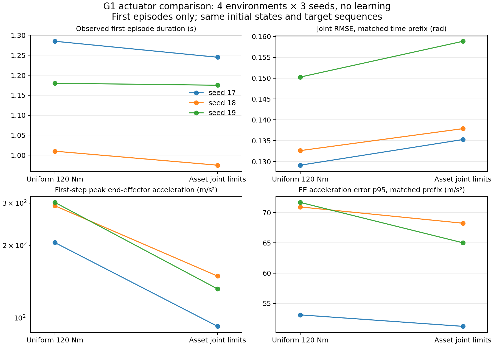

# 逐关节力矩上限：小规模物理对照

2026-09-22 已完成。**新限值在 PhysX 中正确生效，首步冲击降低，但存活与跟踪未改善。**
本轮没有训练 PPO，也没有执行延期的 v4 最终策略评估。本任务 GPU 进程已退出。

## 设计与配对

只比较 `legacy_uniform120` 与 `asset_effort_v1`。两组均为 kp=80、kd=2、零关节姿态
普通 reset、平地、无随机化/观测噪声/动作延迟/恢复 pool，无学习。
控制周期 0.02 s，物理步长 0.005 s，每场 4 环境 × 150 控制步，预算为 3 秒。

- 静态零姿态：seed 17，两种配置共 2 场。
- 直接参考目标播放：seed 17、18、19，两种配置共 6 场。
- 合计 8 场正常完成，4800 个环境 transition；分析使用每个环境的**首次 episode**。
  参考播放每组 12 个首次 episode；这不是经过训练的策略表现或论文匹配评估。

四对实验均通过：生产/探针代码 hash 一致；除力矩上限外环境配置一致；初始可见状态与
参考帧一致；首次终止前共同时间段的目标角、序列编号、参考帧逐项一致。
比较跟踪和加速度分布时，按每对环境较早的首次终止时间截取共同时间段，排除自动 reset
后不同采样和较短 episode 带来的比较偏差。存活时间独立使用各自首次终止时刻。

读回 PhysX 的 29 个关节 effort、velocity、kp/kd，确认新旧力矩配置与预期一致，
速度上限仍为资产中的 20/22/32/37 rad/s，gain 均为 80/2。名字到运行时关节顺序正确。

## 结果

参考播放的均值 ± 标准差以 **3 个种子的统计量**计算；每个种子有 4 个初始片段。
样本小，只作诊断，不作显著性或泛化收益结论。

| 指标 | 统一 120 Nm | 逐关节限值 |
|---|---:|---:|
| 首次 episode 平均时长，s | 1.158 ± 0.139 | 1.132 ± 0.140 |
| 关节 RMSE，共同时间段，rad | 0.1373 ± 0.0113 | 0.1440 ± 0.0129 |
| 身体 RMSE，共同时间段，m | 0.1113 ± 0.0128 | 0.1163 ± 0.0119 |
| 首步机器人末端加速度峰值，m/s² | 266.7 ± 53.1 | 124.5 ± 29.2 |
| 末端加速度误差 p95，共同时间段，m/s² | 65.24 ± 10.53 | 61.48 ± 9.06 |
| 首次 episode 提前终止 | 12/12 | 12/12 |
| 超过 45 rad/s 的首次 episode transition | 0 | 0 |

“首步峰值”是每个种子四环境、四末端中最大的加速度向量范数，再跨种子统计。
此均值下降约 53%；不能将它解释为整体控制性能提升。三个种子的平均首次时长均未提高，
共同时间段的关节与身体 RMSE 均略变差。

| 参考 seed | 旧/新平均首次时长，s | 旧/新首步加速度峰值，m/s² |
|---|---:|---:|
| 17 | 1.285 / 1.245 | 205.6 / 92.2 |
| 18 | 1.010 / 0.975 | 292.5 / 149.2 |
| 19 | 1.180 / 1.175 | 302.1 / 132.0 |

静态零姿态：两组均在第 74 步（1.48 秒）因 root_low 终止。首次 episode 的 q、qd、
root position/quaternion 与末端加速度轨迹逐位一致，最大关节速度仅 2.79 rad/s；
采样的最后子步力矩估计没有饱和。机器人逐渐倾倒（root up_z 从约 1 降至 0.370），
这一次提前倒下不能归因于统一 120 Nm 上限。零姿态固定目标不是闭环平衡策略。

图表：`runs/actuator_physics_20260922/comparison.png` / `.pdf`。



仓库内：[聚合结果](results/actuator_comparison_20260922.json)、[配对统计 CSV](results/actuator_comparison_20260922.csv)。

## 已定位的异常来源与仍未知的部分

1. **初始化到首个参考目标存在大跳变。** seed 17 的最大变化接近 1.97 rad，
   seed 18 为 1.71 rad。seed 18、19 的大加速度出现在首步机器人手腕，而对应参考
   手腕加速度接近零，支持“首步控制响应产生冲击”的判断。尚未比较参考状态 reset。
2. **参考自身也存在加速度尖峰。** seed 17、env 0、第 17 步、seq 23、frame 2407.20，
   参考右腕加速度范数约 161.25 m/s²；相同尖峰也出现在静态目标对照中。
   这可以与机器人的首步冲击区分，但不能仅据此判定参考数据错误或直接降低奖励权重。
3. **本轮未复现历史超速与 recovery KL 尾部异常。** 两组参考播放最大关节速度分别
   为 36.930 / 36.999 rad/s。本轮没有恢复初始状态、动力学随机化或 PPO 更新，
   因而不能声称那些历史异常已经解决。
4. `applied_torque` 和饱和比例仍是隐式 PD 的最后物理子步估计，不是真实测量力矩，
   也不是整个控制周期内每个子步的饱和记录。

## 判断与下一步

保留经过资产与 PhysX 双重确认的逐关节上限，不为了稍好的短时播放结果恢复不匹配的
120 Nm。物理接口验收通过；当前结果不支持直接扩大正式 Stage 1。

下一步固定新上限，单独对比零姿态 reset 与参考状态初始化。后者必须同步 q/qd、
root pose/velocity、落地高度、历史、动作延迟队列；登记为论文未公开细节的工程假设。
之后用简单固定片段做短 PPO 学习诊断，再回到全库 + recovery。是否调整 PD，要另作
独立对照。本轮不放宽终止、不改奖励权重、不加恢复辅助力。

直接参考 PD 播放不含完整平衡控制，其失败不能证明 PPO 不可学习；这里的结论限于
执行器差异和可定位的瞬态。旧的 v4 最终评估继续后置，并应使用冻结的 v4 协议。

## 修复、验证与资源释放

首次物理接入暴露探针记录的整数 `mean()` 错误；修复为浮点统计，未改训练或奖励代码。
补充异常栈保存，并要求 JSON 状态确认为 completed，防止 Kit 关闭后返回 0 掩盖异常。
两次未完成尝试原样保留并排除于结果；8 场有效实验均完整运行 150 步、退出码 0。

新增首次 episode/共同时间段分析回归，相关 CPU 检查 10 passed；最终分析用实际 8 场数据
通过了源码、配置、初始状态、目标以及执行器读回检查。没有重新运行整个 CPU 测试集。

GPU 使用为 UUID `GPU-d86528b1-67d4-d67f-db2c-ccae580a1267`（nvidia-smi 9，Vulkan 8），
串行执行。完成后未发现本任务探针或训练进程；卡上剩余其他用户的约 1.6 GiB 占用，
未终止或修改任何其他用户进程。

全部原始记录位于 `runs/actuator_physics_20260922/`：

- 每场 `response.json`：reset 前逐步物理状态、首次终止、跟踪数据。
- 每场 `response.diagnostics/`：执行器读回和有界异常快照。
- 每场 `manifest.json`、`command.sh`、`run.log`、`exit_code`：复现条件与退出记录。
- `summary.json`、`paired_results.csv`、图表和绘图脚本：CPU 汇总。
- `gpu_before.csv`、`gpu_after.csv`、进程快照：资源使用与释放检查。
- `source_snapshot.tar.gz`、`source_manifest.json`：本轮代码与分析版本。

CPU 重算：

```bash
CUDA_VISIBLE_DEVICES='' OMP_NUM_THREADS=1 MKL_NUM_THREADS=1 \
  /data/jxc/envs/pbfm_isaaclab/bin/python -m setup.analyze_actuator_response \
  runs/actuator_physics_20260922 --output <新的汇总JSON路径>
```
