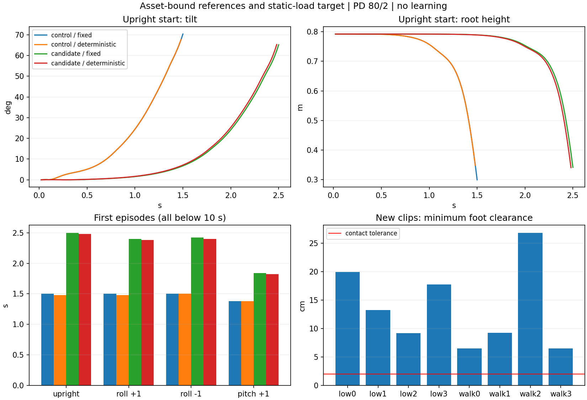

# 资产一致参考与静态载荷目标：执行结果

2026-09-22，完成已批准方案的阶段 A+B。PD **80/2**、奖励项和权重、A23、终止规则保持不变。
没有执行 PPO 更新，也没有扩规模训练。四组物理比较共 **1596 / 8000 transitions**，GPU 已释放。

候选改善了短时站立，但没有解决动态平衡；新参考解决了几何/放置一致性，尚未达到训练数据质量要求。



聚合证据：[完整 JSON](results/asset_standing_validation_20260922.json)、
[导数审查 JSON](results/reference_derivatives_20260922.json)。
原始证据保存在 `runs/asset_standing_validation_20260922/`；旧数据、旧实验和失败的 CPU 审查尝试均保留。

## 1. 几何、参考地面与八个新片段

增加显式 `G1Kinematics(urdf)`，离线 retarget、FK、Jacobian 和 IK 可绑定运行 URDF。
保留旧 XML 路径用于复算历史证据；本轮新导出入口为 `setup.build_asset_reference_subset`。
新导出没有修改旧数据目录 `data/processed/lafan1_g1_mesh_v2`。

核查实际 USD/URDF 的 29 个关节原点、轴和相对旋转、刚体质量/COM、双脚各 4 个碰撞球。
固定连杆的质量合并以 USD 刚体边界为准，避免重复计入独立手部刚体。
USD 中无碰撞、质量为零的相机/head 占位连杆不贡献重力。
USD authored rest quaternion 存在约 9.58e-5 的舍入差异；实际仿真 FK 读回最大位置误差
**2.50e-7 m**、四元数误差 **1.79e-7**，通过运行时核对。
全身离线支撑高度使用 URDF 碰撞几何；本轮未逐面证明所有 USD 全身碰撞网格与 URDF 完全一致。

新目录为 `data/processed/lafan1_g1_asset_grounded8_v1`，对应原来冻结的相同 8 个源片段和起始帧。
先处理完整源序列，再裁出 150 帧评分段及未来参考 padding（共 172 帧）。高度只作一次全序列
刚性平移，以完整序列的最低碰撞点为零；没有按裁剪片段或逐帧重新压脚到地面。
接触仍由离线几何与平面查询得到，2 cm 容差沿用现有工程假设。

新数据标记 `flat_ground_v1`：源地面映射到世界平地 z=0，保留相对地面高度，不随 nominal
reset 根高重新锚定。对每个片段的 150 帧、两种 reset 逐一核对：参考根高差和接触不一致率
均为 **0**；reference_state 没有附加高度抬升。该 v1 约定显式仅限平地 Stage 1，
尚未扩展到 Stage 2 terrain tile 的映射。

| 片段 | 新参考最低足底间隙 cm | 最大关节速度：旧→新 rad/s | 腰 pitch 贴上限：旧→新 |
|---|---:|---:|---:|
| low_motion_0 | 19.93 | 3.253→3.253 | 0%→0% |
| low_motion_1 | 13.27 | 3.935→3.931 | 0%→0% |
| low_motion_2 | 9.21 | 3.903→8.767 | 0%→0% |
| low_motion_3 | 17.75 | 5.934→5.934 | 0%→0% |
| slow_walk_0 | 6.47 | 2.274→2.266 | 100%→100% |
| slow_walk_1 | 9.27 | 3.130→3.136 | 40.7%→41.3% |
| slow_walk_2 | 26.82 | 3.519→3.544 | 100%→100% |
| slow_walk_3 | 6.51 | 5.046→5.082 | 86.0%→89.3% |

全部关节角满足限位；速度与保存关节角直接差分的误差不超过 2.39e-7 rad/s。
但 low_motion_2 最大相邻角度变化从 0.1301 增至 **0.2922 rad**，不能宣布连续性改善。
身体关键点相对源目标误差仅有小幅降低。8 个评分片段全部没有参考足接触；这些片段名为
低运动/慢走，持续悬空与预期支撑不符。全序列碰撞锚定提供一致且不穿地的基准，
**不等于找到了准确的源动作地面或动态可行的重定向**。
新版本保留为诊断数据，暂不用于正式训练；需要进一步解决源地面估计、形态差异及 IK 时序问题。

## 2. 唯一冻结候选的静力依据

期望实际姿态仍为 q=0，两组初始关节状态相同。候选只改变用于承载重力的位置目标。
质量 **35.1151 kg**，中立支撑根高 **0.791864 m**，COM 为约 [0.01957, 0.000072, 0.72068] m。
解八个接触点的最小范数竖直法向力，满足合力及水平力矩平衡；各法向力 **35.21–50.91 N**，
切向力为零。利用 COM/接触点 Jacobian 求：

`tau_required = gravity_generalized - J_contact.T @ normal_forces`

`q_target = q_pose + tau_required / 80`

力平衡残差为零，水平力矩残差约 1.34e-15 Nm；虚功独立数值差分回归通过。
最大目标偏移 **0.06177 rad**，最大静态所需力矩约 **4.942 Nm**，占对应上限 **9.88%**。
例如左踝 pitch 目标 +0.04027 rad、左膝 +0.03898、腰 pitch −0.06177。
所有目标严格处于合法关节范围内。没有添加外部支撑力或另一套力矩控制器。

这一解证明所选姿态存在静态载荷分配，不保证 PhysX 的单边接触与阻尼过程会实现该分配，
也不证明固定目标具备恢复姿态的反馈能力。候选在物理实验之前冻结，实验后没有搜索第二个候选。

## 3. 受控物理结果

每组 4 环境、最多 500 控制步，控制周期 20 ms、物理子步 5 ms。
起点依次为直立、roll +1°、roll −1°、pitch +1°；脚部初始最小间隙 1 mm。
参考、起点、种子、网络参数一致；跨条件唯一网络参数差异为预先登记的 Actor 最后一层目标偏置。
策略均值指未训练策略的确定性输出，不是 PPO 训练后的策略。

| 条件 | 四个起点首次时长 s | 平均 s | 完成 10 s | transitions | 子步速度峰值 rad/s |
|---|---|---:|---:|---:|---:|
| 原目标 / 固定 PD | 1.50 / 1.50 / 1.50 / 1.38 | 1.47 | 0/4 | 300 | 8.48 |
| 原目标 / 策略均值 | 1.48 / 1.48 / 1.50 / 1.38 | 1.46 | 0/4 | 300 | 8.44 |
| 候选 / 固定 PD | 2.50 / 2.40 / 2.42 / 1.84 | 2.29 | 0/4 | 500 | 3.79 |
| 候选 / 策略均值 | 2.48 / 2.38 / 2.40 / 1.82 | 2.27 | 0/4 | 496 | 3.70 |

每个起点取四组共同存活窗口，分别为 1.48 / 1.48 / 1.50 / 1.38 s：

| 指标 | 原固定 PD | 候选固定 PD | 原策略均值 | 候选策略均值 |
|---|---:|---:|---:|---:|
| 平均倾角 ° | 20.39 | 3.28 | 20.45 | 3.38 |
| 关节 RMSE rad | 0.05109 | 0.01796 | 0.05112 | 0.01819 |
| 加权 EE 加速度代价 | −0.05827 | −0.00420 | −0.05815 | −0.00422 |

候选四个起点均比匹配对照保持更久，共同窗口内姿态误差更低，支持载荷目标有效。
所有候选最终因根高过低结束，仍未实现稳定站立。不能据此宣称训练收益、泛化或多种子成功率。
首次 episode 的每脚接触占比从约 95.2% 增至 98.3%；最大执行器估计力矩占限值约 52%–53%，
无饱和样本，无 >45 rad/s 子步。接触冲击峰值没有降低（约 819–821→863–869 N），
所以不能宣称所有物理指标都改善。

保存了控制步的根姿态、关节、足部接触/力、估计力矩和 EE 速度/加速度原始 trace。
子步速度每 5 ms 读取，保存峰值、越限计数和异常快照；**未保存完整子步速度时间序列**。
`applied_torque` 是隐式执行器估计值，不是完整约束求解力矩测量。
transition 预算包含某个环境提前结束后、等待其他首次 episode 结束期间的短暂 reset 后样本；
行为分析只使用首次 episode。四个子进程 PID 均退出，GPU 9 无本任务残留进程。

## 4. EE 加速度审查与修正

奖励比较左右踝 roll、左右腕 yaw 的 **link 原点世界线加速度**，单位 m/s²；
平方求和的量纲为 m²/s⁴，权重仍为 **−0.001**，不额外乘 dt。
物理端使用同一个控制步前后的世界线速度差 / 0.02 s。逐帧重算与奖励一致，reset 后历史速度
清零正确，没有混入上一 episode 的速度；静止参考加速度恒为零。

从修改前源码快照复算证实：匀速 1 m/s 参考被算出了首帧 50 m/s² 的假加速度。
新实现用源帧上的三点二次速度估计，再比较 t 与 max(t−control_dt,0)，首源帧无前史时为零。
额外验证发现以控制间隔在 30 Hz 线性插值轨迹上取点仍有误差，因此最终改用原始源帧节点，
避免 30/50 Hz 不一致造成假加速度。静止、匀速、匀加速、匀速 yaw、小幅膝正弦运动、
首末帧及坐标旋转检查通过；五组解析验证的最大加速度误差小于 **3.84e-4 m/s²**。

最后的源帧节点修正发生在物理运行后：执行源码和最终源码分别保留指纹；CPU 对本次静止
参考的全部 501 个时刻比对，所有返回张量完全一致。因此未重跑 GPU，也没有把新实现冒称为
已重新物理测试。旧版本的未验证 `acceleration_before.json` 不是基线证据；
有效基线为 `acceleration_before_verified.json`。

环境 checkpoint 增加导数/放置契约检查，拒绝静默恢复旧语义；recovery pool 指纹包含新地面
及资产元数据。最终契约为 `reference_linear_derivatives_v3`。旧数据与旧结果保留，正式续跑
不能绕过这些检查。本轮没有重建 recovery pool。

## 5. 复验与后续

CPU 回归：`CUDA_VISIBLE_DEVICES='' OMP_NUM_THREADS=1 MKL_NUM_THREADS=1 python -m pytest tests -q`。
最终 **847 passed、2 skipped**，见[验证记录](results/asset_standing_verification_20260922.json)；
资产 FK/Jacobian、虚功、两种 reset、导数端点、恢复兼容性均覆盖。
资产一致性和静态可行性的范围限制见上文，不能把单测全部通过当作动态可行证明。

可以根据原方案第三分支考虑有反馈的有界站立学习：候选保留为实验初始化，先验证 20 更新
接口，再决定是否进入多种子学习。该阶段本轮未启动。8 个新动作片段的悬空/贴限/连续性
问题应独立处理，不能把它们混入站立学习后将失败归因于 PPO；正式 Stage 1 扩规模继续暂缓。

重建八片段使用：

```bash
python -m setup.build_asset_reference_subset \
  --bvh data/raw/lafan1 --old-reference data/processed/lafan1_g1_mesh_v2 \
  --manifest eval/manifests/fixed_tracking_diagnostic_20260922.json \
  --urdf /path/to/runtime/g1.urdf --asset /path/to/runtime/g1.usd \
  --output /path/to/new/reference --evidence /path/to/new/evidence
```

目录必须不存在，防止覆盖。CPU USD 审查/候选入口为 `setup.prepare_static_load_candidate`
（需 pxr 环境，不启动 SimulationApp）；物理入口为 `setup.check_static_support --condition
control|candidate --mode fixed|deterministic`，完整执行命令和预算保存在 `execution_ledger.json`。
诊断数据不纳入 Git，沿用项目对 LAFAN1 衍生数据的管理方式；生成脚本、清单及聚合结果可审查。
