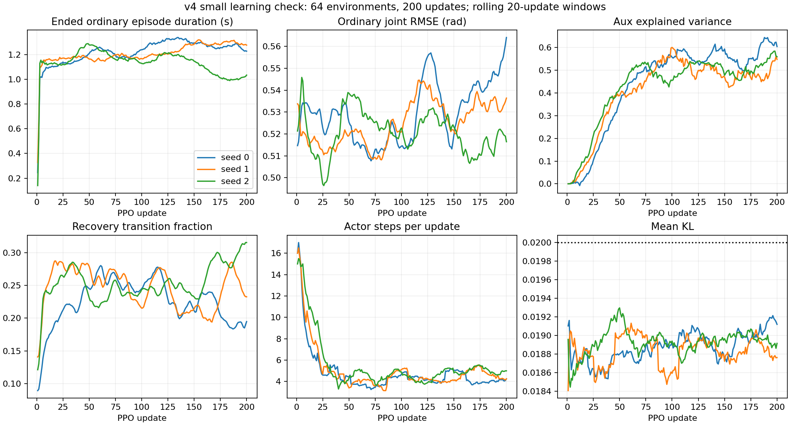

# v4：课程、终止诊断与价值拟合

本轮实现用户确认的四项修正。保留 PGMT 的动作/观测接口、共享 IFM、三头/四头
critic、两阶段流程，以及 Table I 全部奖励项和权重。新增调度和优化参数都是
论文未公开细节的工程假设，不声称与作者代码相同。

依据：[PGMT §IV-A](https://arxiv.org/html/2609.08511v2#S4.SS1)、
[RGMT §II-D](https://arxiv.org/html/2601.23080v1#S2.SS4)。PGMT 写明基于生存表现
渐进增加离线跌倒池初始化比例，没有给出调度函数；RGMT 给出 3 秒恢复窗口，
但其辅助拉力是否被 PGMT 继承未获明确说明。本轮不接入辅助外力。

## 实现与假设

- **A10 课程**：单独统计普通 episode 的 `duration / horizon`，在最近 100 集
  上取均值。至少积累 20 个普通 episode 后，每新增 20 个复核一次，目标概率为
  `0.1 + 0.4 × 普通生存比例`，每次向目标移动最多 0.02。恢复成功/失败单独
  记录，不直接提高难度；实际 recovery transition 占比独立报告。
- **A20 终止**：身体偏差与奖励使用相同的 yaw/root 局部坐标和链接集合，避免
  把全局位移混作身体姿态误差。根位置世界坐标误差仍记录；低高度、倾斜、速度、
  地形边界、30 秒时限和 3 秒恢复宽限保留。多个同时触发的原因均记录，因此
  原因计数之和可能超过提前终止数。
- **初始化诊断**：在每个 episode 的第一个控制步记录 reset 时关节姿态与参考
  起始帧的 RMSE。当前普通 reset 仍是默认关节姿态，不自动改为参考姿态初始化。
- **A6 critic completion**：可用 `--critic-completion` 启用。在联合 PPO 达到
  KL 预算后，用分离梯度的共享特征，仅更新 critic 自己的 backbone 和输出头，
  补至原有 `epochs × minibatches` 的价值更新步数上限。原奖励、GAE、缩放和
  value clipping 保留。额外 minibatch 使用独立、可恢复的 RNG，不扰动 actor
  的采样随机流。默认保持关闭，在线对照后再决定是否作为训练默认值。
- **学习率日程**：`--updates` 仅是本次绝对停止点；`--lr-schedule-updates`
  是完整线性日程长度，默认 1000。续跑省略日程参数时从 checkpoint 继承，
  显式改变日程会报错。1000 是工程配置，不是论文报告的训练迭代数。
- **KL 诊断**：保留整批平均预算 0.02，并记录整体、普通、恢复三组的均值、
  p50/p95/p99/max。分组和分位数是诊断指标，并非新增的接受阈值。

训练契约更新为 `pgmt_curriculum_critic_v4`。旧的未训练物理跌倒池可加载；
旧训练 checkpoint 不作为 v4 续跑起点。恢复课程和 critic 的 RNG 一并保存。

## 固定物理 batch 的先验对照

重用之前保存的 neutral-init 物理 batch，将其中的历史接触力平方奖励重算为
已接受的接触计数奖励。它不用于续跑策略，仅用于相同数据上的优化诊断。

联合 PPO 在第 13 步达到平均 KL 0.019964 后停止。冻结 actor/共享编码器、
补充 7 个带 value clipping 的 critic 步后：

| 头 | 联合更新后 raw MSE | 补充 7 步后 raw MSE |
|---|---:|---:|
| upper | 408.84 | 389.37 |
| lower | 657.94 | 643.63 |
| aux | 38247.85 | 38211.56 |

Actor 均值逐元素完全不变。补充更新有可测效果，但 aux 改善很小，不足以说明
价值拟合已经解决。100 步不裁剪的额外拟合仅作诊断，未接入生产配置。

产物：`runs/curriculum_v4_20260921/{probe_critic.py,critic_probe.json}`。

## 在线验证设计

先运行两个从零、同 seed 的 16 环境 × 24 步 × 20 更新物理试验：

- `pilot16`：开启 critic completion。
- `control16`：其余 v4 设置相同，关闭 critic completion。

两者都使用 1000 更新的 LR 日程、相同 77 个参考序列和 16 状态真实跌倒池。
使用同一份源码快照。先验检查包括每轮有限值、KL 上限、实际更新步数、课程
概率变化、终止原因、分组误差和初始化误差；不以短跑成功率作为正式评测。

v4 修改了身体偏差的终止坐标口径，episode 时长不能与 v3 直接当作学习效果
对比。正式比较必须让所有策略使用相同 v4 终止规则、匹配初始条件和 30 秒评测。

## 16 环境在线对照结果

两组均完成全部 20 次更新、正常退出，指标和 checkpoint 有限，每轮 actor 都有
实际更新，奖励分项求和一致。798 项 CPU 回归通过、2 项跳过。

| 指标 | completion 开启 | completion 关闭 |
|---|---:|---:|
| 整批平均 KL 范围 | 0.01808–0.01998 | 0.01812–0.01989 |
| actor / critic-only 更新步数 | 108 / 292 | 117 / 0 |
| 最终 recovery reset 概率 | 0.1153 | 0.1145 |
| recovery transition 比例 | 19.69% | 19.09% |
| 普通已结束 episode 平均时长 | 1.145 s | 1.090 s |
| recovery 完整 episode 成功数 | 0 / 9 | 0 / 8 |
| 最后一次 aux explained variance | 0.107 | 0.051 |
| 全程平均 aux explained variance | 0.061 | 0.037 |

开启组的补充更新在 18/20 批上进一步降低 aux 原始 MSE，平均相对变化为
−4.59%；upper/lower 为 14/20、13/20，平均约 −1.54%、−1.55%。但 tracking
两头的全程平均 explained variance 没有胜过关闭组，不能只选择最后一轮的
数值报告，也不能将不同轨迹上的 raw MSE 直接比较。单 seed 短试验只能支持
补充拟合步骤有效执行，尚不足以证明策略行为改善。

普通 episode 的终止以倾斜、低高度和关节超速为主；开启组分别触发 46、32、35
次，身体偏差触发 1 次，各原因允许重叠。恢复 episode 均在 3 秒窗口后因低高度
和倾斜退出。普通 reset 的初始关节 RMSE 约 0.484 rad，是下一步需要控制变量
检查的线索，尚不能认定为失败原因。此轮没有放宽速度/姿态阈值或更改 PD 参数。

最后一轮计划学习率为 9.81e−5，短跑停止点没有再把学习率衰减至零；KL 回退
仍可降低该轮实际 actor 步长。整批均值预算不等于逐状态预算：开启组观测到的
最大状态 KL 为 0.724，最高批次 p99 为 0.166，继续单独记录。

原始产物位于 `runs/curriculum_v4_20260921/{pilot16,control16}/`，各含命令、
metrics、checkpoint、退出码和自动断言结果 `summary.json`。`source_manifest.json`
与 `source_snapshot.tar.gz` 固定这两组的源码。

## 小规模学习验证

下一层验证使用新采集的 256 状态物理跌倒池，从零运行三个种子（0、1、2），
每组 64 环境 × 24 步 × 200 更新、LR 日程 1000、开启 completion。每组另存
未训练 `initial.pt`，用于相同条件的冻结策略诊断。这是学习趋势检查，不是正式
Stage 1 扩规模训练；三个开启组也不能代替多种子的 completion 开/关因果对照。

新池和训练命令分别保存在 `collect256/`、`learn64_seed{0,1,2}/`；学习验证源码
由 `learning_source_manifest.json` 与 `learning_source_snapshot.tar.gz` 固定。
三组均已完成 200 次更新，结果见下节；最终策略物理评估按用户要求后置。

**用户调整（2026-09-21）**：三组训练仍在第 200 次更新停止并释放本轮 GPU
进程；最终策略的 GPU 评估后置。等待中的评估调度已取消，后续自动任务只做
CPU 汇总（`finalize.py --training-only`）。决定记录在 `evaluation_deferred.json`，
最终评估的手动入口为 `resume_final_eval.sh`，未自动启动。

冻结策略诊断使用 `matched_9600_v2.json` 的前 12 个 flat/L0 episode；每个种子的
initial/final 使用相同参考、起始帧、随机种子、30 秒上限和 v4 终止口径。
评估身份同时记录环境、假设和奖励实现的 hash，拒绝向旧口径文件追加结果。
flat/L0 的动力学扰动按现有清单定义为 nominal，观测扰动与动作延迟仍开启。
这个子集不覆盖 recovery 初始化，不用于报告论文整体或高难度成绩。三个初始
策略的基线均已完成：每种子 12 集、平均时长均为 1.5 秒、30 秒完成数均为 0。
最终策略未评估，不能报告匹配条件下的训练前后收益。后置评估应使用本轮冻结
源码与配置；如果先修改物理参数或终止规则，则需在新条件下重新评估初始策略。

## 200 更新结果（训练内统计）

三组均从零完成 64 环境 × 24 步 × 200 更新，每组 307200 transitions，共
921600 transitions。于北京时间 2026-09-21 20:49:50–20:50:16 完成，退出码
均为 0；CPU 汇总于 20:50:36 完成。训练和评估进程均已退出，最终策略评估
未启动。本轮释放的是自己的 GPU 占用，不代表共享 GPU 上没有其他任务。

每组均通过：指标/模型/优化器有限值、checkpoint 更新数和 v4 契约一致、每轮
有效 actor 更新、整批 KL 上限、每轮 20 个价值更新步、LR 日程和奖励分项求和。
源码 hash 与冻结快照一致。三组平均 KL 的全程最大值为 0.019992，最后一轮
计划学习率均为 8.01e−5，最终 recovery reset 概率为 0.1149–0.1175。

以下为三个种子的均值 ± 样本标准差。episode 时长只统计对应窗口内已结束的
普通 episode；它们是自适应采样下的训练数据，不能替代冻结匹配评估。

| 指标 | 最初 20 轮 | 最后 20 轮 |
|---|---:|---:|
| 普通 episode 时长（秒） | 1.125 ± 0.025 | 1.180 ± 0.128 |
| 普通 joint RMSE（rad） | 0.519 ± 0.010 | 0.539 ± 0.024 |
| 普通 body RMSE（m） | 0.142 ± 0.001 | 0.150 ± 0.004 |
| upper explained variance | 0.096 ± 0.075 | 0.712 ± 0.015 |
| lower explained variance | 0.116 ± 0.071 | 0.720 ± 0.018 |
| aux explained variance | 0.087 ± 0.040 | 0.570 ± 0.030 |
| recovery transition 比例 | 24.25% ± 4.40% | 24.75% ± 6.18% |

末段普通 episode 时长分别为 seed 0：1.228 秒、seed 1：1.277 秒、seed 2：
1.035 秒。全程 11592 个普通 episode 和 1471 个 recovery episode 均未完成
30 秒；recovery 均在 3 秒宽限结束后终止。普通终止仍以低高度、倾斜和关节
超速为主，各原因允许重叠。

**支持的结论**：课程不再因恢复失败而快速增难；平均 KL 约束有效；critic 对
训练 rollout 目标的拟合明显改善。**尚不支持的结论**：跟踪行为稳定改善、已学会
恢复、达到正式扩规模训练的验收条件。三种子只有 completion 开启组，不能把
全部变化归因于该优化开关；该开关仍保持显式启用，默认值未改为开启。

### 平均 KL 之外的尾部问题

三组观测到的最大逐状态 KL 分别为 8.341、16.280、4.961。seed 1 的第 179 轮，
整批均值仅 0.019678、p99 为 0.025479，但一个 recovery 状态达到 16.280，
普通状态的最大值仅 0.025311。平均预算通过不能说明每个状态的更新都很小；
下一轮需要定位这些 recovery 状态，再决定是否加入分组或尾部约束。

末端加速度加权惩罚的全程峰值为 4359.15。若干 aux 拟合回落与该惩罚的尖峰
同时出现，但现有日志未分开记录机器人和参考加速度，因此不能直接归因于
执行器、参考数据或某一奖励实现。下一步应补充分解诊断，保留论文奖励权重。

产物：`training_summary.json`、三个 `learn64_seed*/summary.json`、
`validation_status.json` 和 `learning_curves.{png,pdf}`，均位于本轮 runs 目录。
图中为 20 轮滑动窗口，仅展示训练内趋势。

仓库内可下载[训练内汇总](results/curriculum_v4_20260921.json)。最终策略匹配评估尚未执行。

## 后续排查线索（未改变本轮配置）

只读检查本地 G1 URDF 后，确认当前统一 120 Nm 的 `torque_limit` 与资产中的
逐关节 effort 有差异：例如 wrist pitch/yaw 为 5 Nm、肩/肘为 25 Nm、膝为
139 Nm。当前 Isaac actuator 配置会显式写入配置力矩上限，因此下一轮应先核对
资产约束、逐关节控制增益与实际触发超速的关节，不能通过提高终止阈值掩盖问题。
URDF 约束也不等于论文作者未公开的 actuator 配置，需注明来源并做物理对照。

对 77 段共 496672 个参考帧的静态检查得到：相对默认零关节姿态的全库 RMS
为 0.5083 rad，任一参考关节超过 45 rad/s 的帧占 0.0952%。后者存在但不常见，
不能直接用来解释训练中频繁超速。是否采用 reference-state initialization、
是否需要处理参考运动的个别尖峰，均需单独对照后决定。本轮源码保持冻结。

诊断原始结果：`asset_joint_limits.json`、`reference_initialization_diagnostics.json`。
另已完成 v4 Stage 1 checkpoint → Stage 2 四头 critic 的一次 CPU/mock 协议检查
（`stage2_protocol.json`），不将该结果当作 Stage 2 物理学习验收。
