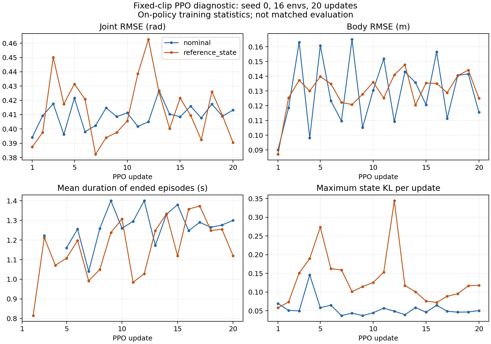

# 固定简单片段的短 PPO 对照

本轮限定为 seed 0、两种普通 reset 各 16 环境 × 24 steps × 20 updates，合计
15360 transitions。目的为检查真实策略动作下的物理接口、有效更新和首步冲击。
它不是正式 Stage 1，也不是最终策略评估；不据此宣称收敛或论文复现成功。

## 冻结清单与控制变量

[片段清单](../eval/manifests/fixed_tracking_diagnostic_20260922.json)在物理训练前生成，
包含 4 个训练片段和 4 个保留检查片段，每段 5 秒，另留至少 0.62 秒未来参考。
每个片段来自不同动作序列；训练与检查按序列分开，未声称按受试者分开。

筛选只使用参考运动学：root 倾斜 ≤15°、高度变化 ≤0.12 m、关节速度峰值 ≤15 rad/s。
低运动量来自 aiming 序列，root 水平平均速度 ≤0.25 m/s、逐帧关节速度 RMS 的
p95 ≤1 rad/s；慢走来自 walk 序列，水平速度 0.2–0.8 m/s、关节速度 RMS p95 ≤1.5。
这是工程诊断筛选，不代表静态站立或已经验证的动力学可执行性。初步更严的低运动量
阈值（0.10 m/s、0.8 rad/s）只能留下一个序列，因此在训练前调整并完整记录最终规则。

每个序列在 1 秒网格上选最低运动量的 5 秒窗口，各类最优四个序列中 ranks 0/2 训练、
1/3 保留检查。本轮不执行保留片段评估。每个环境按固定序列顺序轮换，重置时点可以不同；
生产采样器的无用随机抽样被隔离，不能因重置次数不同而消耗策略探索随机流。

两组均使用 `asset_effort_v1`、kp=80、kd=2、USD 原有速度限值、平地。关闭 recovery、
adaptive sampling、动力学随机化、观测噪声、动作延迟；正式训练入口仍要求 recovery pool。
保留现有奖励、终止阈值、bounded joint-target policy 与 critic completion。
5 秒片段边界按 timeout bootstrap，不当作物理失败，也不当作正式 30 秒完成率。

Actor 初始化均为现有接近零关节目标、latent std=0.1 的策略；学习率初值 1e-4，
固定 1000 更新衰减日程，独立在第 20 次更新停止；每轮 5 epochs × 4 minibatches，
全 rollout 平均 KL 预算 0.02。两组仅 `reset_mode` 不同，未对首步动作做替换或预热。
因此上一轮 reference PD 播放的低冲击结论不能直接外推到本轮 PPO。

## 实现与验证

- `setup/build_tracking_diagnostic.py`：冻结片段、筛选依据及全库/URDF/USD SHA-256。
- `pgmt/train/fixed_clip_diagnostic.py`：独立诊断入口、确定性 episode 清单、首步实际目标与
  加速度证据、预重置统计、有界 KL 快照。checkpoint 使用 `diagnostic_ppo`，拒绝作为正式
  Stage 1/2 checkpoint 静默使用，无 resume 接口。
- `setup/run_fixed_clip_pair.py`：只串行运行两场 20 更新任务；同时检查进程退出码和
  metrics 完成状态，防止 Kit shutdown 掩盖 Python 异常；无后续 GPU 任务。
- `setup/analyze_fixed_clip_diagnostic.py`：CPU 配对校验、checkpoint 有限性检查、
  KL 重放、统计与图表。原始日志、初始/最终 checkpoint、运行源码快照均保留。

全量 CPU 回归 827 passed、2 skipped；随后新增的指纹篡改与正式 Stage 2 隔离检查也通过，
本模块合计 12 项检查通过。两种 reset 均完成 2 环境 × 2 steps × 1 update 的 CPU 协议检查，
初始 policy/optimizer/RNG 完全一致。首个 CPU 试跑发现记录器错误地假设 torch 适配器提供
tracking extras，修正为预重置捕获后通过；失败记录保留，不计入物理结果。

## 结果

两场均完成 20/20 更新、退出码为 0；北京时间 14:08–14:16 完成，分别约 239 秒和
221 秒（含启动）。本任务两个训练 PID 421989、1577640 及 CPU supervisor 421982
均已退出，GPU 已释放。未启动 200 更新、正式扩规模、Stage 2 或延期的最终策略评估。

配对检查通过：初始 policy/optimizer/CPU 与 CUDA RNG 完全相同；初始参考序列、帧与
q/qd 相同，环境配置仅 reset_mode 不同，运行核心源码相同。PhysX 29 个关节的
effort/velocity/kp/kd 读回一致，默认姿态与参考 q/qd 初始化检查通过。所有记录的真实
首步执行目标与 PPO 输出逐元素相等；每轮均有有效 Actor 更新，checkpoint 与指标有限。

| 指标 | nominal | reference_state |
|---|---:|---:|
| 已结束 episode 平均时长，全部 20 轮 | 1.259 s | 1.163 s |
| 前 5 → 后 5 轮的平均结束时长 | 1.205 → 1.267 s | 1.034 → 1.269 s |
| 前 5 → 后 5 轮关节 RMSE | 0.408 → 0.413 rad | 0.417 → 0.406 rad |
| 前 5 → 后 5 轮身体 RMSE | 0.130 → 0.134 m | 0.125 → 0.135 m |
| 提前终止次数 / 到达 5 s 的 timeout 次数 | 112 / 0 | 123 / 0 |
| 触发 joint_speed 终止的 episode | 4 | 12 |
| 累计 Actor optimizer steps / 每轮最少 | 97 / 1 | 102 / 2 |
| 累计 critic optimizer steps | 400 | 400 |
| 全 rollout 平均 KL 的最大值 | 0.019764 | 0.019895 |
| 单状态 KL 的最大值 | 0.145981 | 0.344091 |

这里的结束时长仅统计在相应窗口内结束的 episode，未结束的 episode 不计入均值。
跟踪误差按 transitions 加权。两组重置时点、各片段曝光量和学习中的状态分布不同，
不能把这些训练内均值当作冻结策略的匹配评测。单个种子、20 更新也不足以判断收敛。
本轮没有发现一致的身体跟踪与存活收益，暂不据此选择参考 reset 或扩大训练。

### 首步策略动作与播放实验的区别

仅比较初始 16 个 episode 的第一个真实策略动作：

| 首步指标 | nominal | reference_state |
|---|---:|---:|
| target − 当前 q 的 RMS | 0.185 rad | 0.426 rad |
| target − 当前 q 的最大绝对差 | 0.895 rad | 2.478 rad |
| 四末端状态加速度峰值 | 85.05 m/s² | 162.65 m/s² |
| 四末端状态加速度 p95 | 74.34 m/s² | 124.58 m/s² |

参考初始化组最大的目标差距集中在左右 shoulder_pitch（RMS 分别约 1.02、1.22 rad）。
初始策略的目标接近零姿态，与参考 reset 的姿态存在明显差距。**本轮实际策略动作下，
参考初始化的首步冲击更大**，没有复现上一轮参考 PD 播放的低冲击结果。这支持下一步
审查策略初始目标与 reset 的匹配，但并不能证明肩部目标差距是全部跌倒的唯一原因。

### 超速与 KL 快照

两组分别捕获 4 个超速事件快照，8 个快照的最大速度关节均为 `left_ankle_roll`。
默认组快照中最大绝对速度 80.83 rad/s，候选组 90.08 rad/s；完整状态快照每类最多
4 个事件，所以候选组其余超速不能从这 4 个快照重建，也不能把 90.08 称为整场最大值。
超速发生在 episode 约 0.66–1.52 秒，仍需排查速度映射、驱动响应与接触/约束行为；
仅凭这些数据不能给出唯一根因，也不应通过放宽终止阈值或裁剪日志来隐藏异常。

默认组 1 个、候选组 4 个 KL 事件，共 20 个状态的 CPU 重放均通过；包含两组最大
单状态 KL 的事件。原始观测、前后权重、Normal 参数及逐关节 KL 均保存。本轮没有
recovery 状态，不能声称解决了 v4 的 recovery KL 尾部问题。

### 下一步

维持新力矩限值与默认 reset。先用已保存证据定位左踝 roll 超速，再设计只改变策略初始
目标/初始化匹配的短对照；保留关节位置目标 + PD、正确 log-prob、现有奖励和终止规则。
任何初始化候选必须明确登记，不能把 reference 动作偷偷替换进 rollout。
物理异常处理后，再决定是否安排 64 环境、多种子的学习诊断；本轮不会自动续跑。

完整统计、证据 SHA-256 与逐轮数据见[JSON](results/fixed_clip_ppo_20260922.json)，
趋势见下图。核验后的结论可同步至对应项目的 `PROJECT_MEMORY.md`；本次没有改写
上层另一个研究路线的记忆文件。



## 原始证据与复现命令

服务器原始目录：`runs/fixed_clip_ppo_20260922/physical_pair_v1`。
运行源码：该目录的 `source_snapshot/`；每场目录内另有完整源文件 hash、配置与清单。
`initial.pt`/`policy.pt` 是诊断 checkpoint，`episode_evidence.json` 保存所有 reset 和真实首步动作。

```bash
env CUDA_VISIBLE_DEVICES='' OMP_NUM_THREADS=1 MKL_NUM_THREADS=1 \
  /data/jxc/envs/pbfm_isaaclab/bin/python -m setup.run_fixed_clip_pair \
  --root runs/fixed_clip_ppo_20260922/physical_pair_v1 \
  --gpu-uuid GPU-d86528b1-67d4-d67f-db2c-ccae580a1267 --render-gpu 8 \
  --manifest eval/manifests/fixed_tracking_diagnostic_20260922.json \
  --reference-data data/processed/lafan1_g1_mesh_v2 \
  --asset /data/jxc/projects/ProtoMotions-v2.3/protomotions/data/assets/usd/g1.usd \
  --urdf /data/jxc/projects/ProtoMotions-v2.3/protomotions/data/assets/urdf/g1.urdf
```

再次运行必须换一个新输出目录；设备 UUID/Vulkan 编号也应依据本机配置确认。
原始数据、第三方资产和模型文件不加入本次结果发布清单。
