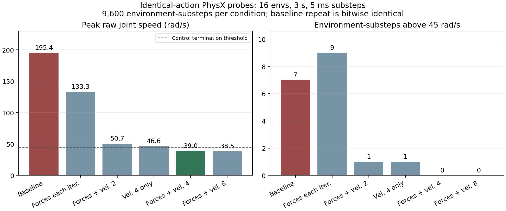
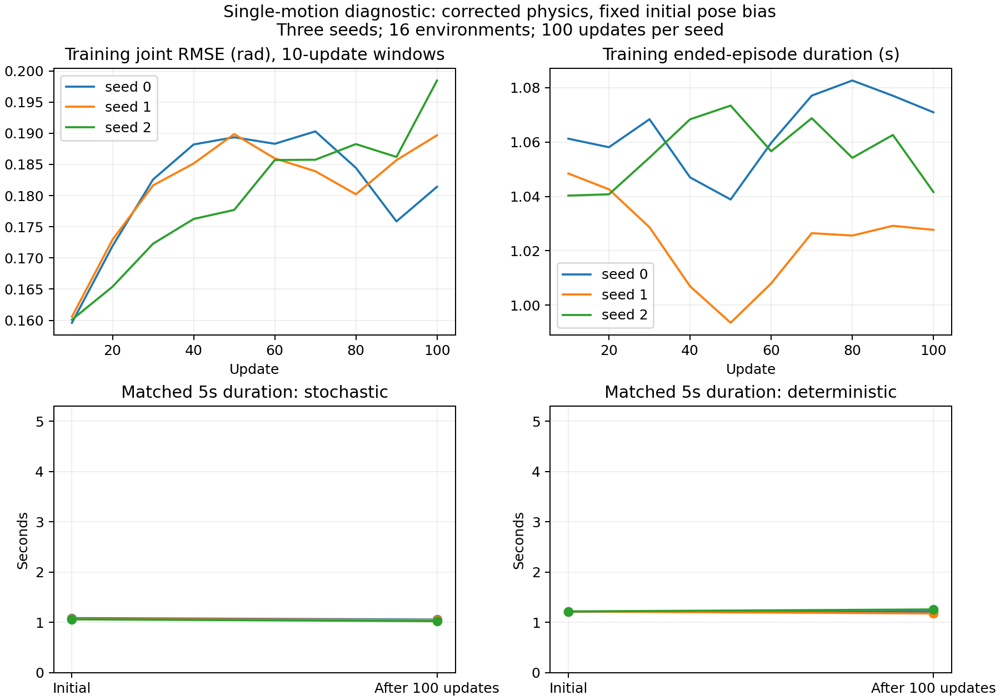

# PhysX 子步修正与单动作学习验证

2026-09-22 已完成。**物理速度尖峰明显降低；单动作学习验证没有通过行为验收。**
三个种子各完成 100 更新及训练前后配对检查，存活没有改善，关节误差增大。
九个训练/检查进程均退出码 0，本任务 GPU 占用已释放。
本轮不属于正式 Stage 1 扩规模，也不替代后置的 v4 最终评估。

## 物理问题与同动作对照

上一轮固定片段 PPO 捕获左踝 roll 超速。本轮在每个 5 ms 物理子步直接读取
`root_physx_view` 的 q/qd、关节目标、根部和身体状态，同时记录缓存读数、
q 的时间差分、接触力及隐式 PD 的估计力矩。估计力矩不是求解器实测驱动力矩。

基线采用上一轮未训练的策略，生成一次随机动作序列。所有候选重复同一动作文件，
固定 16 环境、初始状态、四个简单片段的 reset 顺序、PD、资产和终止规则，
每场 150 控制步（3 s），即 600 子步、9600 个环境子步；共七场，含一次基线重复。
自动 reset 后仍播放同一时间索引的动作。状态及各环境 reset 时刻会随物理条件分化，
所以这是受控的动作回放诊断，不是各候选策略重新决策的闭环性能对比。

原始 PhysX 与缓存的 q/qd 在全部探针中完全一致，实际 PhysX 目标也等于发送目标。
canonical 的左踝 roll 索引 5 对应运行时索引 17，右踝 roll 索引 11 对应 18。
基线重复的全部 q/qd 轨迹逐位一致。最大的左踝 roll 原始速度为 -195.420 rad/s，
同一子步的位置差分为 +7.187 rad/s，前后相邻速度为 -0.630、-3.706 rad/s。
这些证据排除了所检查路径上的缓存/关节映射错误，并支持求解器敏感性；
位置区间平均速度与瞬时速度的差异本身不是完整的动力学根因证明。

USD 左右脚踝质量/惯量对称，没有修改资产。USD 已设置 32 次位置迭代和 1 次速度迭代。
旧场景的 `min_velocity_iteration_count=0` 是场景下限，不能解释成资产没有速度迭代。

| 配置 | 原始速度峰值 rad/s | >45 rad/s 环境子步 | 超速控制步终止 | 首次 episode 平均时长 s |
|---|---:|---:|---:|---:|
| 原基线：外力逐迭代关、速度下限 0 | 195.420 | 7 | 3 | 1.2225 |
| 完全重复基线 | 195.420 | 7 | 3 | 1.2225 |
| 只开外力逐迭代 | 133.260 | 9 | 2 | 1.2650 |
| 外力逐迭代 + 速度下限 2 | 50.660 | 1 | 0 | 1.2737 |
| 只设速度下限 4 | 46.616 | 1 | 1 | 1.2525 |
| **外力逐迭代 + 速度下限 4** | **39.006** | **0** | **0** | **1.2725** |
| 外力逐迭代 + 速度下限 8 | 38.480 | 0 | 0 | 1.2637 |



采用外力逐位置迭代和速度迭代下限 4：这是本轮测试中消除该动作序列 >45 尖峰的
最低组合。单独开启外力逐迭代仍存在 133 rad/s 尖峰，不能仅根据文档建议认定有效。
8 次没有带来值得采用的额外收益，且引擎对超过 4 次速度迭代给出版本行为变化提示。
候选峰值比基线降低约 80%，但仍高于脚踝资产名义速度上限 37 rad/s；
本结果不证明所有关节严格满足资产上限。首次时长约 1.22→1.27 s 也不是稳定行走证据。

设置依据为本机 Isaac Lab 2.3.2 的实现及其
[PhysxCfg 文档](https://isaac-sim.github.io/IsaacLab/v2.3.2/_modules/isaaclab/sim/simulation_cfg.html)。
该开关改变已有力在 TGS 迭代中的处理，不是新增拉起机器人或维持平衡的辅助外力。
完整聚合与轨迹指纹见 [JSON](results/substep_physics_20260922.json)。

## 落地的修正与论文边界

新增工程假设 **A23**，在 `G1EnvConfig` 中显式保存两个 solver 字段，并在 Isaac
场景初始化前应用。新配置进入环境状态和 checkpoint，拒绝把旧物理 checkpoint
静默续跑到新设置；需要旧设置时显式传入 `False/0`，或使用对应冻结源码。
旧实验数值仍属于旧物理协议，不能与新协议的结果直接合并。

保留 5 ms 物理步长、20 ms 控制周期、逐关节资产力矩上限、原速度上限、kp=80/kd=2、
关节位置目标动作、奖励权重与终止规则。没有裁剪观测速度或掩盖超速。
正式入口默认 reset 仍为 `nominal`。论文没有披露本求解器组合，A23 属于独立复现
的数值实现选择，不称为作者设置，也不代表已经完成论文流程验证。

## 单动作学习协议

采用冻结清单 `eval/manifests/single_walk_diagnostic_20260922.json`：
`slow_walk_0`，源序列 `walk2_subject4`、起始帧 1380，5 s。
原筛选中平均根速度 0.255 m/s、关节速度 RMS 的 p95 为 0.494 rad/s；
这说明片段较慢，不证明其动态可执行性。其余七个片段标记为未使用。
全部参考文件、URDF、USD 使用 SHA256 校验，没有重新生成或覆盖参考数据。

三个种子 0/1/2，各 16 环境 × 24 步 × 100 更新，共 **115200 transitions**。
每种子固定 100 更新停止，学习率日程仍按 1000 更新定义。使用新物理设置，
参考状态 reset、单一固定起点；关闭 recovery、adaptive sampling、随机化、噪声和延迟。
这些简化仅用于可学习性诊断，后续正式 Stage 1 仍需恢复完整流程。

actor 初始固定均值目标设为片段起始姿态，使用既有有界动作分布的初始化接口。
归一化目标离边界留 1% 半程裕量，最大参考偏移为 0.0052 rad（腰 pitch）。
这只是网络初始 bias，后续 rollout 每一步仍执行策略真实采样动作；
不逐帧注入参考目标、不替换第一步动作、不改变 log-prob 契约。
因此本轮是“新物理 + 固定初始 bias + 单片段”的可学习性检查，不能把与上轮
混合片段的差异单独归因于 reset、solver 或初始化中的任一因素。

每种子使用独立进程检查 initial 和第 100 更新 checkpoint，各检查包括随机采样动作
和确定性均值动作，最多 5 s、16 个环境首次 episode；提前结束后的自动 reset
数据不进入存活/跟踪统计。两次检查使用同一参考、初始条件和评估种子 10000+seed。
三种子均值和样本标准差是主要汇总单位：确定性同起点的 16 个副本不是 16 个独立场景。
跟踪 RMSE 在各自实际存活区间按 transition 汇总，因此区间随策略不同，需与时长合看。

另加被动子步监控，覆盖训练每一个 5 ms 子步，不改变动作或终止。评估子步监控还包含
等待其他首次 episode 结束时已自动 reset 的环境，故其全程尖峰统计不等于首次集的失败率。

## 学习结果

三种子均完成固定预算，训练中每轮至少有一次有效 Actor 更新。以下训练内数字
为三个种子统计量的均值 ± 样本标准差，不替代随后冻结策略的配对检查。

| 训练内指标 | 前 10 更新 | 后 10 更新 |
|---|---:|---:|
| 已结束 episode 平均时长 s | 1.0500 ± 0.0106 | 1.0468 ± 0.0221 |
| 关节 RMSE rad | 0.1601 ± 0.0005 | 0.1898 ± 0.0085 |
| 身体 RMSE m | 0.1004 ± 0.0006 | 0.1070 ± 0.0030 |

| seed | Actor 总更新步 | 最大平均 KL | 最大单状态 KL | 原始子步速度峰值 rad/s | >45 环境子步 / 控制步超速终止 |
|---|---:|---:|---:|---:|---:|
| 0 | 314 | 0.019992 | 0.08530 | 44.412 | 0 / 0 |
| 1 | 326 | 0.019996 | 0.16309 | 45.767 | 1 / 0 |
| 2 | 319 | 0.019992 | 0.54555 | 46.477 | 1 / 1 |

被动监控覆盖全部 460800 个训练环境子步，仍捕获 2 个 >45 rad/s 子步，
不能把短回放的 0 次越界推广为整个训练完全无异常。原来的约 195 rad/s 大尖峰
未在这批新条件训练中复现，但训练条件与回放不同，不能用两者估计同条件发生率变化。
平均 KL 满足 0.02 预算，单状态最大仍有 0.54555；本轮没有 recovery 样本，
因此也不能声称历史 recovery KL 尾部已经修好。

冻结策略的配对结果如下，均值 ± 样本标准差来自三个训练种子：

| 检查方式 / 指标 | 初始策略 | 100 更新后 |
|---|---:|---:|
| 随机动作：首次平均时长 s | 1.0733 ± 0.0128 | 1.0442 ± 0.0165 |
| 随机动作：关节 RMSE rad | 0.1597 ± 0.0007 | 0.1982 ± 0.0118 |
| 随机动作：身体 RMSE m | 0.1054 ± 0.0005 | 0.1073 ± 0.0037 |
| 随机动作：完成 5 s | 0/48 | 0/48 |
| 确定性动作：首次平均时长 s | 1.2200 ± 0.0000 | 1.2200 ± 0.0400 |
| 确定性动作：关节 RMSE rad | 0.1204 ± 0.0001 | 0.1443 ± 0.0131 |
| 确定性动作：身体 RMSE m | 0.10089 ± 0.00005 | 0.10244 ± 0.00186 |
| 确定性动作：完成 5 s | 0/48 | 0/48 |

三个种子的随机动作时长均下降，关节误差均增加，汇总增幅约 24.1%。
确定性动作时长分别为 1.22→1.22、1.22→1.18、1.22→1.26 s；
三个种子的关节误差也均增加。两种动作方式的首次 episode 均没有超速终止；
六个检查进程全部子步的峰值为 38.826 rad/s，未出现 >45 rad/s 环境子步。
因此即使这组检查没有大幅超速，当前策略仍不能稳定完成简单片段。
这一负结果不证明 100 更新已经收敛，也不证明论文不可复现。



[汇总、配对校验及逐种子数据](results/simple_learning_20260922.json)。

## 参考与启动动作的附加核查

CPU 核查源帧 1380–1529：该片段腰 pitch 在全部 150 帧均为 +0.52 rad，
正好位于机械上限（核查容差 1e-4 rad）。源文件的离线 mesh 接触标签中，
左右脚接触比例为 14% / 0%；这属于源参考坐标中的标签，不是当前物理运行实测接触率。
上轮清单的另外三个 slow-walk 片段，腰 pitch 贴限比例为 40.7%、100%、86%。
因此按速度小筛选并不能保证动作未被限位裁剪，也不能保证动态可执行。
这些记录支持下一步检查参考姿态和支撑几何，不足以单独证明重定向错误或本轮失败根因。
见 [单片段审查](results/single_clip_reference_20260922.json)及
[八个候选的限位占比](results/fixed_clip_limits_20260922.json)。本轮未改清单或数据。

固定初始 bias 的实际均值目标最大偏差约 0.0052 rad；但三个种子的首次随机采样
目标相对 reset q 的 RMS 分别为 0.1833、0.1837、0.1719 rad，首步末端加速度峰值为
79.13、96.51、94.88 m/s²。探索噪声仍然存在，不能把均值目标对齐解释成实际首步动作
完全等于参考。该指标与上轮不同片段/物理条件的数值不构成单因素效果对照。

## 下一步决策

保留经同动作对照支持的 A23 和逐关节资产限值，继续记录剩余小尖峰，不放宽速度终止阈值。
本轮支持结束这次诊断，**不支持直接扩到完整 Stage 1 或继续堆更新次数**。

下一步先在 CPU 上核对代表性慢走片段的腰部姿态来源、IK 限位、根高及足底支撑几何，
区分原始人体姿态、重定向裁剪和参考放置的影响。不能仅因贴限就自动改数据或挑选好看的结果。
若发现实现问题，生成新数据版本并保留旧版本；用独立的静态站立/小幅运动诊断检验基础
平衡，再做固定预算、多种子的可学习性验证。探索幅度、初始化或 PPO 尾部保护如需调整，
分别做单因素对照，保持论文奖励权重和位置目标控制语义。

达到可重复的行为改善后，再回到完整参考库、recovery pool、adaptive sampling；
历史 recovery KL 问题和 v4 的 30 s 评估仍单独保留。本轮诊断策略不能当作正式 Stage 1 prior。
本报告结论建议同步到对应项目的 `PROJECT_MEMORY.md`。

## 验证与复现

CPU 全套 `python -m pytest tests -q`：**836 passed, 2 skipped**。
之后增加被动子步监控，相关诊断检查 **19 passed**。
从仓库根不限定目录执行 `pytest -q` 曾收集到 `runs/` 中保存的同名冻结源码，
导致 collection 冲突；已保留该日志并使用正式 `tests/` 目录重跑通过。
最终 CPU 审计确认源码快照指纹一致、训练及配对条件满足协议、每种子 153600 个
训练环境子步完整、所有 checkpoint 有限、每轮 Actor 有效更新且平均 KL 合规。
initial/final 的 q/qd、root pose/velocity、参考状态、历史、动作队列和目标逐项匹配
（容差 2e-5；不宣称 PhysX 接触缓存逐位相同）。六个 KL 快照的九个状态均通过 CPU 重放。
物理聚合从七份原始轨迹重算后与此前汇总完全一致；`git diff --check` 通过。
见 [最终验证记录](results/physics_learning_validation_20260922.json)。

原始证据目录：`runs/physics_learning_20260922/`。

- `substep_*_v1/`：每场完整 `substeps.pt`、相同 `actions.pt`、metrics、运行配置和诊断快照。
- `source_before_physics/`：修正生产配置前的探针源码；`learning_v1/source_snapshot/`：训练与检查源码。
- `learning_v1/seed{0,1,2}_train/`：initial/final checkpoint、逐更新指标、参考 reset/真实动作证据。
- `learning_v1/seed{0,1,2}_{initial,final}_eval/`：训练前后首次 episode 检查。
- 每个学习批次子进程记录命令、PID、日志和退出码；CPU 分析验证源文件指纹与配对条件。

GPU 9 / Vulkan 8，UUID `GPU-d86528b1-67d4-d67f-db2c-ccae580a1267`。
学习批次脚本只运行三个种子的上述固定预算及 5 s 检查，已完成并退出。
已核对九个 PID 均不存在，GPU compute process 列表没有本任务 PID；卡上的其他任务未处理。

重跑必须选新目录，并先核对 GPU 空闲资源：

```bash
CUDA_VISIBLE_DEVICES='' OMP_NUM_THREADS=1 MKL_NUM_THREADS=1 \
  /data/jxc/envs/pbfm_isaaclab/bin/python -m setup.run_simple_learning_check \
  --root <新输出目录> --workers 3 --gpu-uuid <空闲GPU_UUID> --render-gpu <Vulkan索引> \
  --manifest eval/manifests/single_walk_diagnostic_20260922.json \
  --reference-data data/processed/lafan1_g1_mesh_v2 \
  --asset <g1.usd> --urdf <g1.urdf>

CUDA_VISIBLE_DEVICES='' OMP_NUM_THREADS=1 MKL_NUM_THREADS=1 \
  /data/jxc/envs/pbfm_isaaclab/bin/python -m setup.analyze_simple_learning \
  runs/physics_learning_20260922/learning_v1 --output <新JSON路径> --plot <新PNG路径>
```
