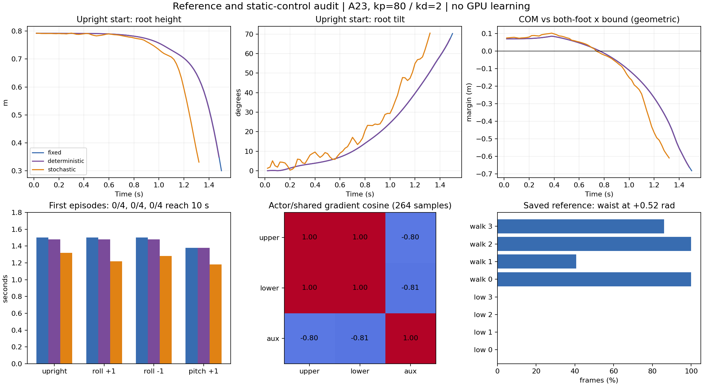

# 参考数据、静态支撑与真实 rollout 审查

2026-09-22。已完成 CPU 参考审查、三组有界静态物理对照及真实样本的 CPU PPO 重放。
**零位固定 PD 的无扰动基准在 1.50 s 终止，未通过本轮预定的 10 s 诊断门槛。**
因此没有进入 16 环境 × 20 更新或三种子 × 100 更新的后续物理学习。
三个 GPU 子进程均正常退出，已核对 `/proc` 和 GPU 进程列表；无本任务 GPU 残留。

聚合数据：[主审查 JSON](results/reference_control_audit_20260922.json)、
[参考放置与接触 JSON](results/reference_placement_audit_20260922.json)。
原始证据目录：`runs/reference_control_audit_20260922/`。

## 1. 实际修改与范围

新增五个独立诊断入口：

- `setup/audit_reference_control.py`：BVH → 解析重定向 → IK → 保存数据的逐阶段复算，URDF COM/脚部几何。
- `setup/audit_reference_placement.py`：nominal 参考垂直放置后，在同一平地重新查询接触。
- `setup/check_static_support.py`：独立合成站立参考、三种控制方式、首次 episode 与真实 rollout 采集。
- `setup/audit_captured_rollout.py`：生产 collector 的 CPU 重放、独立 GAE、分头梯度和一次 CPU optimizer 更新。
- `setup/analyze_static_support.py`：配对初始状态校验、首次 episode 汇总和图表。

本轮没有修改生产 Actor、PPO、奖励、PD、终止规则或 LAFAN1 数据。
数据几何和放置问题已被定位，**尚未重生成修正后的参考库**。零位静态参考只用于本轮诊断，
不能替换论文训练数据或作为正式 Stage 1 成功结果。

## 2. 参考动作：没有保存错误，但有模型与坐标约定问题

冻结清单中的 8 段各 150 帧，全部 29 维关节角与重新执行解析重定向 + IK 的结果逐位一致。
切片后的 IK finalize 会改变全序列最低点锚定常数和首帧速度，因此没有错误地要求这些量也逐位相等。

`slow_walk_0` 的源相对旋转映射到机器人腰部后，pitch 为 **0.43349–0.68094 rad**，
解析阶段裁到合法区间，IK 后整段为 **+0.52 rad**。其他三个慢走片段贴上限占比分别为
40.67%、100%、86%。这是现有映射和约束优化的真实输出，不是 NPZ 损坏。
源关节坐标旋转与髋到颈的几何方向是不同量，不能通过简单把腰部角归零来“修复”。

已查明几何版本来源：重定向硬编码对应 `g1_29dof_rev_1_0.xml`，当前运行 URDF 则对应
`g1_29dof.xml` 的腰部尺寸。

| 相对位置 | 离线 FK | 当前 URDF |
|---|---:|---:|
| waist_roll 原点 z | 0.044 m | 0.035 m |
| torso 相对 waist_roll 的 z | 0 | 0.019 m |
| shoulder_pitch 相对 torso 的 z | 0.24778 m | 0.23778 m |

零位 torso 原点差 1 cm；所查片段 torso 最大坐标差约 1 cm，肩臂误差随腰部旋转改变。
这需要按实际资产统一离线 FK/IK，并生成保留版本和指纹的新数据；目前没有证据表明
这 1 cm 就是约 1 秒跌倒的全部原因。

接触标签可以按原始根坐标、URDF 脚部球体与平地 2 cm 阈值完全复算。但 4 个低运动片段
有 3 个左右脚标签全为零，其原始脚部高度明显高于查询平面。进一步应用 production nominal
的参考根高放置（首帧锚到 0.793 m），保持平地 z=0，重算标签与原标签的逐帧逐脚不一致比例为
**49.67%–99.00%**；`slow_walk_0` 为 **90.00%**。

这是参考被垂直平移、查询平面和离线标签未随之统一的证据。它不是实际 nominal 机器人状态
的接触统计，也不含 `reference_state` reset 的碰撞抬升。Stage 1 不使用 terrain-contact
奖励，因此这一发现不能直接解释本轮 Stage 1 失败。Stage 2 前必须明确参考地面、垂直锚定、
接触标签与世界地形的同一坐标约定，不能静默覆盖旧标签。

## 3. 静态控制：固定目标本身未保持住

合成参考：所有关节为零，根高 0.793 m，单位根四元数，静止双脚接触标签；长度 12 s，
留出未来参考帧。四个预先固定起点依次为零倾角、roll +1°、roll −1°、pitch +1°，
只按 URDF 脚部球体几何抬升穿地的起点，关节和根部速度均为零。

保持当前 A23、5 ms 物理步长、20 ms 控制步长、PD 80/2、资产逐关节力矩/速度限值。
关闭随机化、观测扰动、延迟、recovery、自适应采样。三个独立进程使用同一 seed=0、
逐位相同的初始策略参数和同一状态清单，均无 PPO 更新。

每组上限 4 环境 × 500 控制步，全部首次 episode 结束则提前退出。实际执行
300 + 296 + 264 = **860 transitions**，其中 **835** 属于首次 episode。
其余 25 条来自等待最后一个环境结束时其他环境自动 reset 后的正常执行；首次 episode
统计排除了它们。随机组完整 264 条都保留用于合法的跨 episode rollout 审计。

| 控制方式 | 零倾角 | roll +1° | roll −1° | pitch +1° | 子步最大速度 | >45 rad/s 子步 |
|---|---:|---:|---:|---:|---:|---:|
| 固定零位关节目标 PD | 1.50 s | 1.50 s | 1.50 s | 1.38 s | 3.080 rad/s | 0 |
| 未训练策略均值 | 1.48 s | 1.48 s | 1.48 s | 1.38 s | 3.070 rad/s | 0 |
| 同策略随机动作 | 1.32 s | 1.22 s | 1.28 s | 1.18 s | 37.000 rad/s | 0 |

三组均为 **0/4 完成 10 s**，终止原因是根高过低和/或倾倒。共观察 **3440 环境子步**。
固定 PD 首步目标 RMS=0；策略均值约 0.000651 rad；随机动作约 0.177284 rad。
固定 PD 和均值的估计力矩峰值只达到对应限值约 52.9%，未见估计力矩饱和。
随机组达到限值，首次 episode 的逐关节逐步饱和比例约 2.54%。隐式驱动的 applied_torque
是估计值，不能当作完整约束求解器的实际力矩测量。

URDF 零位整体质量 35.115 kg，初始 COM 为 (0.01957, 0.00007, 0.72182) m，
投影在双脚几何范围内。固定 PD 基准逐渐前倾，约 **0.78 s** 起 COM x 投影已越过
双脚全部碰撞球中心构成的 x 范围，随后倒下。该范围比实际有效接触区域宽松；
几何内外判据不替代摩擦、压力中心或完整动力学稳定性判据。
报告里的足部水平速度是接触足 link 的速度，含滚动，不能全部称为接触点滑移。

这排除了“本轮仍由 >45 rad/s 尖峰触发终止”，并说明探索噪声不是固定 PD/均值也失败的解释。
**零位固定目标不稳定不等于 PhysX 错误，也不等于 PPO 不可能学会平衡。**
论文策略包含反馈控制；10 s 固定 PD 仅是这次预先约定的工程诊断门槛，不是论文要求。

## 4. 真实学习信号：接口检查通过，分头信号存在冲突

随机物理组保存了观测、实际动作、pre-tanh 样本、log-prob、各头奖励/价值、next obs、
终止标记、终态观测接口、初始策略参数。逐步断言确认：实际 PhysX 目标等于传入动作，
奖励读取的参考恰好在一次物理控制步后前进一帧，发生在 auto-reset 前。

CPU 使用生产 `PPO.collect_rollout` 重放相同状态和动作，再用独立 float64 NumPy 递推核对 GAE：

| 项目 | 最大绝对误差 |
|---|---:|
| tanh 动作重建 | 1.79e−7 rad |
| log-prob | 7.63e−6 |
| value / next value | 4.47e−8 |
| float32 GAE 对 float64 独立计算 | 9.16e−5 |

264 条真实样本包括 4 次跌倒终止，生产 GAE 和各头归一化优势检查通过。
本轮没有物理 timeout；timeout bootstrap 和跨 episode 截断由已有相关单测覆盖，
不能宣称本轮实际触发了物理 timeout。

全 264 条样本的 upper/lower/aux 平均奖励为 **3.4635 / 3.9181 / −9.7512**。
首次 episode 的主要 aux 加权项：EE 加速度差 −12.3801、根速度 +1.3484、浮动锚点
+0.8502、根姿态 +0.3323、动作变化 −0.0946、根垂直加速度 −0.0391；其余接近零。
首次 episode 与全 rollout 的统计范围不同，不混用其总和。

分别用标准化的三个头优势计算 Actor/共享模块梯度，范数为 **6.624 / 6.598 / 6.429**。
upper 与 lower 余弦约 +0.9988，aux 与二者分别为 **−0.7963 / −0.8121**。
这批样本存在明显相反的梯度方向；仅凭该结果不能断言策略“主动学习跌倒”或修改论文权重。
需要进一步区分加速度信号、短失败片段的回报边界和真正的控制收益。

另在 CPU 上对初始参数副本执行一次完整 PPO 更新，未部署该策略：
15 个包含 Actor 的 optimizer step、0 个 critic-only step；平均精确 KL=0.01820，
最大状态 KL=0.05036，clipped surrogate 约 0 → 0.06263。
正优势样本平均 log-prob 变化 +0.19783，负优势 −0.24062。
这验证了该批样本的更新方向，**不代表仿真行为已经改善**，也不是重建此前 100 更新的历史 rollout。

## 5. 验证、归档和下一步

本轮定向 CPU 回归 **113 passed（15.20 s）**，覆盖训练/GAE、缩放与 KL、参考 reset/FK、
重定向、奖励和既有物理诊断。另完成真实动作/参考时序断言、配对状态/参数校验、
独立 GAE 与 CPU optimizer 重放。没有扩展声称全部仓库测试在本轮重跑。

原始运行分别为 `static_fixed_v1`、`static_deterministic_v1`、`static_stochastic_v1`；
每组保存 command、PID、exit code、metrics、物理轨迹，随机组另存 `rollout.pt`。
`source_before/` 保存本轮前的源码，`source_executed/` 保存执行版本；新增最终分析源码和
产物哈希见 `validation_final.json`。`gpu_release_v1.json` 记录三个子进程均退出且不在 GPU 列表中。

下一步先在 CPU 明确当前资产的静态站姿和重力载荷下所需的关节目标，保持 PD 80/2，
检查目标是否可达、接触和力矩是否可行，再预先登记一个候选与本次控制组做等预算物理对照。
这是诊断目标，不增加外部平衡辅助力，不直接把合成参考替换成完整训练任务。
若静态固定目标本就不构成稳定基准，应明确设计有反馈的站立诊断，避免把固定 PD 的失败
错误地当作论文不可复现的门槛。

同时按当前资产统一离线 FK/IK，统一参考高度与接触查询平面，先生成小样本新版本验证，
再决定是否重建 77 段库。验证基础控制后才恢复 20 更新接口检查和三种子学习对照。
正式 Stage 1 扩规模、Stage 2 和 v4 后置评估均未启动。
重要结论建议同步到 **PGMT 对应的 PROJECT_MEMORY.md**，不写入其他项目的长期记忆。
