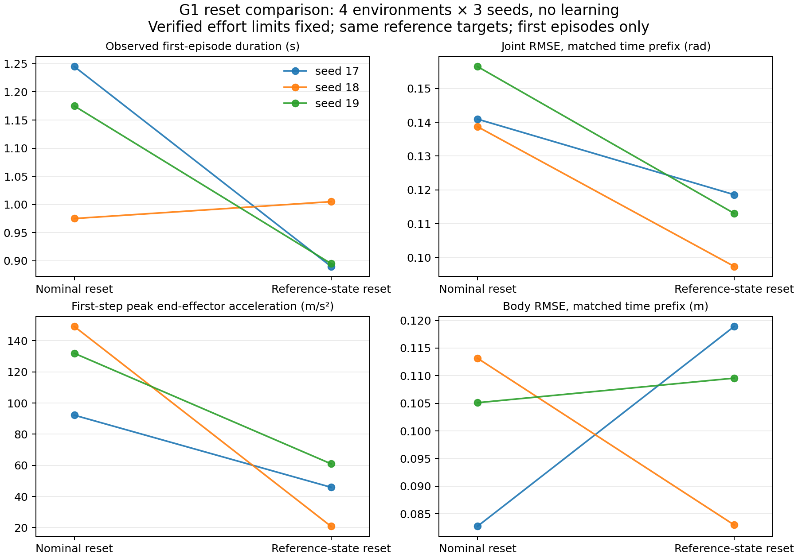

# 固定逐关节上限：默认 reset 与参考状态初始化

2026-09-22 已完成。**参考初始化降低首步冲击、改善关节跟踪，但没有带来一致的身体跟踪
或存活收益。暂不更换正式训练的默认 reset，不据此扩规模。** 6 场物理运行正常退出，
本任务 GPU 已释放。没有启动 PPO 或延期的 v4 最终策略评估。

## 实验条件与初始化定义

两组固定 `asset_effort_v1`、kp=80、kd=2、资产原有速度上限，平地、无随机化、
观测噪声、动作延迟或 recovery pool；关闭 adaptive sampling。直接播放参考关节目标，
不含学习或额外平衡控制。每场 4 环境 × 150 控制步（3 秒），seed 17/18/19，
两组共 6 场、3600 个环境 transitions。主要分析每个环境的首次 episode。

- `nominal`：现有零关节姿态、零速度、根部高度 0.793 m 的 reset。
- `reference_state`：所选帧的 q/qd、根部姿态和世界系线/角速度一起初始化；
  保留参考 pitch/roll，heading 对齐环境默认方向。动作、上一动作、PD 目标及延迟队列
  全部设为初始参考关节角。历史用零填充，随后记录当前观测；不伪造过去的动作/轨迹。
- 根部高度仍以现有 0.793 m 参考锚定为起点，仅当初始 URDF 碰撞几何低于平面时，
  向上平移机器人与整段参考相同距离。不会把已经离地的姿态强行压到地面；
  也不将原始 obstacle 片段中约 1.5 m 的世界根高度直接作为平地出生高度。
  12 个候选状态中 7 个需要抬升，最大 0.038891 m。

这是一个**完整 reset 协议的工程消融**，不是单独改变 q 的消融，也不声称是论文作者的
reset 实现。落地高度策略、历史填充和速度初始化均明确记录。没有预热步骤、首步动作替换、
额外辅助力、奖励权重调整或终止阈值放宽。

新增配置 `G1EnvConfig.reset_mode`，默认仍为 `nominal`；参考初始化仅允许 Stage 1 平地，
要求参考数据和 URDF body tracking。恢复池状态不会被覆盖。本轮没有物理验证恢复状态，
其原有写入语义保留。checkpoint 的 reset 模式不一致时拒绝静默恢复。

## 物理与配对校验

Isaac 的 `write_root_state_to_sim` 写入 link pose 和 COM velocity；参考状态的速度属于
根部 link，所以普通参考 reset 使用 `write_root_link_state_to_sim`。12 个初始状态的
q/qd、根部 pose/velocity 读回最大误差为 5.96e-8。另用零步 reset 检查直接读取
`root_physx_view` 的 joint/root state，将 COM velocity 换算回 link velocity；绕过
ArticulationData 缓存后，12 个状态的最大误差仍为 5.96e-8。
全身速度与 epsilon-FK 的最大绝对差为 0.00248 m/s，首步加速度使用实际物理初速度计算。

高度检查覆盖 URDF 的 mesh、sphere、cylinder、box，以及固定碰撞连杆；mesh 取凸包顶点，
对平面的最低支撑点与原 mesh 相同。候选实际 pose 的最低几何高度不低于 -1.96e-8 m。
该数值是 URDF 几何检查，不包含 PhysX contact/rest offset，也不证明无自碰撞。

两组生产/探针源码 hash 相同，环境配置仅 reset_mode 不同；PhysX 29 个关节的 effort、
velocity、kp/kd 读回一致。初始参考序列、帧、q/qd，以及共同首次 episode 时间段的
实际 PD 目标、参考帧和参考末端加速度逐项相同。

三个 nominal 控制组还逐位复现上一轮新力矩上限下的 **全部 150 步** q/qd、根部姿态、
PD 目标和末端加速度轨迹；初始记录及首次终止记录也完全一致。

跟踪和加速度分布按每对环境较早的首次终止时刻截取共同时间段。首次时长分别使用各自
实际终止时间。自动 reset 后的数据保留在原始文件中，但不混入这些主要结果。

## 结果

均值 ± 样本标准差来自 **3 个种子的统计量**，每个种子 4 个起始片段。小样本诊断，
不作显著性、泛化或策略训练收益结论。

| 指标 | 默认 reset | 参考状态初始化 |
|---|---:|---:|
| 首次 episode 平均时长，s | 1.132 ± 0.140 | 0.930 ± 0.065 |
| 关节 RMSE，共同时间段，rad | 0.1454 ± 0.0097 | 0.1097 ± 0.0110 |
| 身体 RMSE，共同时间段，m | 0.1003 ± 0.0158 | 0.1038 ± 0.0186 |
| 首步机器人末端加速度峰值，m/s² | 124.46 ± 29.22 | 42.59 ± 20.28 |
| 末端加速度误差 p95，共同时间段，m/s² | 66.31 ± 3.36 | 28.91 ± 14.59 |
| 首次 episode 提前终止 | 12/12 | 12/12 |
| 首次 episode 最大关节速度，rad/s | 37.00 | 17.96 |
| 超过 45 rad/s 的首次 episode transitions | 0 | 0 |

首步峰值先取每个种子四环境、四末端加速度范数的最大值，再跨种子统计。
候选此项降低 65.8%，关节 RMSE 降低 24.6%；平均首次时长下降 17.8%。
候选的首次目标相对初始 q 的最大跳变为 0；后续每步仍执行输入参考目标。

| seed | 默认 / 参考平均首次时长，s | 默认 / 参考首步峰值，m/s² |
|---|---:|---:|
| 17 | 1.245 / 0.890 | 92.22 / 45.91 |
| 18 | 0.975 / 1.005 | 149.19 / 20.85 |
| 19 | 1.175 / 0.895 | 131.96 / 61.00 |



仓库内：[聚合结果](results/reset_comparison_20260922.json)、[逐 episode 配对统计](results/reset_episodes_20260922.csv)、
[验证记录](results/reset_validation_20260922.json)。

关节误差与首步冲击在三个种子上均改善；身体跟踪和存活仅 seed 18 改善。
这表明消除零姿态到参考目标的跳变，并不能保证重定向姿态、根速度与接触条件在平地上
构成可稳定维持的运动。参考 PD 播放缺少平衡策略，不能用本结果证明参考 reset 对 PPO 无效。

## 后续决策

保留新力矩上限，保留默认 reset；候选作为显式开关供后续学习消融。下一步应固定少量
站立/简单行走片段，对两种 reset 做同预算短 PPO 学习诊断，比较训练前后的真实控制变化，
而非只比较播放首步。先安排单种子 16 环境、约 20 更新检查接口，再决定多种子预算。
PD、奖励、终止条件和动作分布在该对照中保持一致。

学习诊断通过后，再回到完整参考库、recovery 和 adaptive sampling；恢复状态的速度接口、
历史及尾部 KL 需要专门验证。本轮未产生 PPO 更新，不能宣布历史 recovery KL 尖峰已解决。
v4 最终评估继续后置，恢复时应使用其冻结协议。本报告结论建议同步到对应的 PROJECT_MEMORY。

## 复现与产物

代码：`pgmt/envs/g1_env.py`、`pgmt/envs/reset_geometry.py`；探针与分析：
`setup/check_actuator_response.py`、`setup/analyze_reset_response.py`。
CPU 全量回归 **813 passed, 2 skipped**；随后新增配对分析检查连同已有分析检查 **6 passed**。
`git diff --check` 通过。6 场物理运行均保存 150 步、状态 completed、退出码 0，无失败尝试。
附加的零步状态读回检查发现诊断器多批次记录复用了可变张量引用；改为独立 CPU 快照后
复验通过。早期记录和对应源码保留在 reset_writeback/，最终有效记录在
reset_writeback_verified/writeback.json。这两次检查均未增加物理 rollout 步数。

`runs/reset_physics_20260922/` 保存全部证据：

- 每场 response.json、diagnostics、manifest、command、run.log、exit_code。
- summary.json、paired_episodes.csv、comparison.png/.pdf、plot_results.py。
- reset_validation.json、baseline_reproduction.json、validation_status.json。
- reset_writeback_verified/writeback.json：直接 PhysX 初始状态读回；检查期间不调用 step。
- experiment_manifest.json：条件以及参考 NPZ、URDF/USD、碰撞 mesh 的 SHA256。
- source_snapshot.tar.gz、source_manifest.json：源码、测试及报告版本。
- gpu_before/after.csv、processes_before/after.csv、remaining_task_processes.txt。

运行使用 GPU UUID `GPU-d86528b1-67d4-d67f-db2c-ccae580a1267`（nvidia-smi 9 / Vulkan 8），
串行执行，结束后无本任务 GPU worker。卡上剩余约 1.6 GiB 是其他任务，未终止任何其他任务进程。

单场重跑（新目录；先核对 GPU 映射）：

```bash
PGMT_RESET_MODE=reference_state PGMT_PROBE_SEED=17 PGMT_RENDER_GPU=8 \
PGMT_ISAACLAB_LOG_DIR=<新目录>/isaaclab_logs \
bash setup/run_actuator_check.sh reference asset_effort_v1 <GPU_UUID> <新目录>
```

对照组将 PGMT_RESET_MODE 设为 nominal。CPU 重算：

```bash
CUDA_VISIBLE_DEVICES='' OMP_NUM_THREADS=1 MKL_NUM_THREADS=1 \
  /data/jxc/envs/pbfm_isaaclab/bin/python -m setup.analyze_reset_response \
  runs/reset_physics_20260922 --output <新的汇总JSON路径>
```
