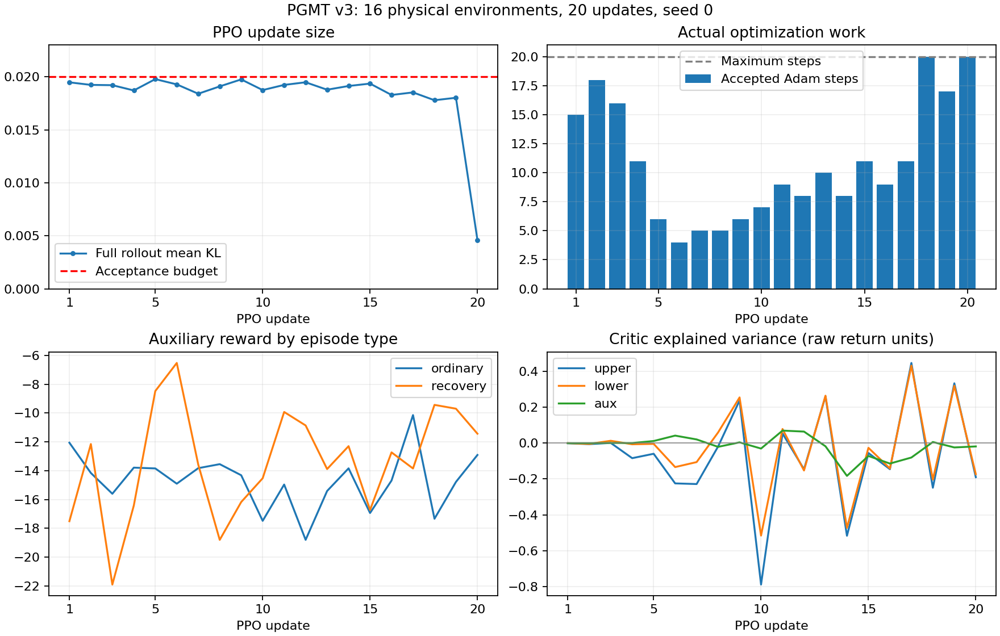

# v3：16 环境、20 次更新物理复验

**四项修改已接入，20/20 次真实物理更新正常完成；数值稳定性检查通过，行为学习尚未达标，暂不扩大训练。**

## 配置与实现

使用 Isaac Lab、GPU 9、seed 0，从零初始化，未加载旧 Stage 1。16 环境，每次
rollout 24 步，20 次更新，共 7,680 条 transition；每个环境累计仿真 9.6 秒。
训练主体耗时 153.84 秒（不含 simulator 启动），进程正常退出，exit code 0。
本次仍使用 16 个真实跌倒状态的小型 recovery pool，未采集正式的大规模 pool。
77 个 mesh-contact 参考序列、动力学随机化、观测扰动和动作延迟均沿用新版配置。

生产代码变更：

1. Actor 均值初始化在默认关节姿态附近，末层 weight×0.01，初始 latent std=0.1。
2. `undesired_contact` 改为超过 1N 的非允许接触部位数量，权重仍为 −0.1；
   EE acceleration mismatch 和 head/torso impact 的公式、权重保持原设定。
3. 每头 value loss 使用固定于本次 rollout 的 `max(std(return),1)` 缩放，
   clipping 同步缩放；reward、value 输出、GAE 和 timeout bootstrap 保持原始单位。
4. PPO 初始 LR=1e−4，整批解析平均 KL≤0.02，超限撤回参数及 Adam 状态并减半
   LR 重试，达到 0.018 后结束本轮。5 epochs×4 minibatches 为步数上限。

采用新的 `pgmt_count_contact_kl_v3` checkpoint 契约，阻止旧奖励版本混入恢复或
Stage 2 初始化。具体工程假设与历史消融见 [诊断与实现](stability_20260921.md)。

## 优化器结果

| 指标 | 实测 |
|---|---:|
| 完成更新 | 20/20 |
| 整批平均 `KL(old || new)` | 0.004610～0.019785 |
| 实际接受的 Adam 步数 | 216/400，每轮 4～20 步 |
| 撤回的超限尝试 | 5 次 |
| 提前结束的更新轮数 | 18/20 |
| LR 首轮 / 末轮 | 1e−4 / 5e−6 |
| 最大 `abs(latent)>3` 比例 | 0 |
| 指标、模型参数、Adam 状态 | 均为有限值 |

约束针对状态平均 KL。单个状态的最大 KL 达 **1.00885**，仍存在少数状态的较大
策略变化，不能把“平均 KL 受控”表述为“每个状态都小于 0.02”。
末轮 KL 下降也包含 20-update 线性 LR 日程的作用，不代表已收敛。

## 奖励尺度与价值拟合

| 加权辅助项 | 全程 transition 均值 | 单步绝对峰值 |
|---|---:|---:|
| undesired contact | −0.08671 | 0.5 |
| EE acceleration mismatch | −17.1431 | 248.80 |
| head/torso impact | −0.23366 | 184.03 |
| action rate | −0.09715 | 0.2732 |

接触计数不再产生此前力平方项的巨大负奖励；这是奖励定义改变，不能把总奖励
跨版本变大归因于学习进步。EE 项仍是主要负奖励，恢复时也仍有明显冲击，不能
因为计数项变小就认定物理动作已经平稳。

| 价值头 | 同一 rollout 上 raw MSE 降低的轮数 | 平均相对变化 | 最后一轮 raw MSE（更新前→后） | 最后 explained variance |
|---|---:|---:|---:|---:|
| upper | 20/20 | −24.20% | 875.78→845.55 | −0.1901 |
| lower | 20/20 | −24.17% | 943.83→901.90 | −0.1734 |
| aux | 19/20 | −5.91% | 7887.09→7376.34 | −0.0185 |

这说明 critic 有实际优化，而非仅缩小了展示的 loss 数字；但最终解释方差仍差，
尤其 aux 拟合有限。不能据此宣称价值拟合已经解决。不同轮的回报目标、参考动作
和普通/恢复混合比例持续变化，表中相对变化只比较每轮内同一批数据的更新前后。

## 普通与恢复 episode

| 指标 | 普通 | 恢复 |
|---|---:|---:|
| transition 数 | 3,635 | 4,045 |
| 提前终止数 | 72 | 19 |
| 已终止 episode 平均时长 | 0.983 秒 | 3.000 秒 |
| 平均辅助奖励 | −14.4127 | −12.7909 |
| 关节角 RMSE | 0.5282 rad | 0.4988 rad |
| yaw 对齐后的身体坐标 RMSE（逐坐标） | 0.1382 m | 0.3038 m |
| 实测最大身体接触力 | 1,599 N | 4,722 N |

19 个已完成的 recovery outcome 全为失败，全部在 3 秒宽限期结束时终止；
普通 episode 的提前终止不应一律称为跌倒，因为也有 tracking 终止条件。
没有任何 30 秒 timeout；本次短跑不构成匹配评测，也没有证明学会恢复或稳定跟踪。

恢复 transition 占比从前 5 轮的 **13.3%** 升至后 5 轮的 **85.8%**。这是
recovery 失败后采样概率上升、恢复 episode 比普通 episode 更长共同作用下的
实际数据分布；每次 reset 的概率上限 0.5 并不意味着 transition 占比上限 50%。
前后总奖励变化不能直接当作策略改进。后 5 轮普通样本仅 273 条，其跟踪误差也
没有显示明确改善。

下一步优先检查 critic 拟合和 recovery 课程造成的数据比例变化，再决定进一步
训练的规模与时长；保留本轮已验证的数值约束。没有自动启动后续训练。

## 回归与产物

- 全套 CPU 回归：**791 passed、2 skipped**。新增检查覆盖接触计数/冲击分离、
  初始化、价值缩放、全 rollout KL、Adam 多次回退、旧 checkpoint 拦截以及
  reset 前的 episode 分组。
- 使用本次物理 checkpoint 完成 Stage 2 **CPU mock** 四头协议检查：1 次更新，
  平均 KL=0.01875，接受 5 步、回退 3 次。这只验证新契约转接，不是 Stage 2
  物理训练或地形能力验收。
- 自动核验：退出码、20 次更新与 checkpoint 一致性、真实 backend、16 环境、
  全部有限值、每轮有效更新、KL 上限、奖励分项求和、运行期间源码未变，均通过。

运行目录：`runs/stability_v3_20260921_16env20upd/`。

- `run.sh` / `manifest.json`：完整命令、环境变量、Git 基线、源码哈希。
- `source_snapshot.tar.gz`：本次运行使用的源码快照。
- `policy.pt` / `metrics.json` / `train.log` / `exit_code`：checkpoint、逐轮指标、日志、退出码。
- `verify.py` / `verification.json`：可重跑的核验和汇总。
- `training_metrics.png`：KL、实际更新步数、分类奖励、原始单位下的 explained variance。
- `pytest.log` / `stage2-protocol.json`：回归与 Stage 2 mock 转接结果。

