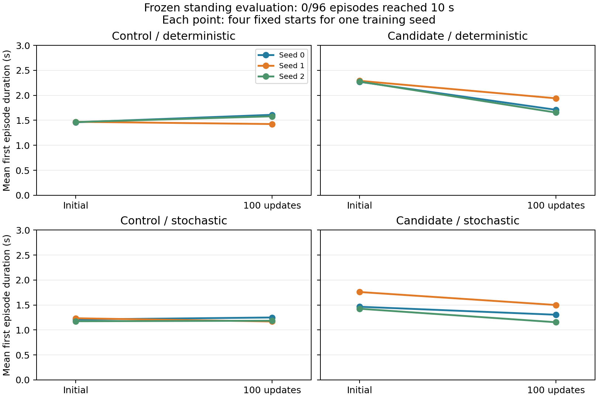

# 冻结站立策略匹配评估：2026-09-29

**24 项评估与独立 CPU 复核均已完成。** 实际运行 **7984 / 48000 transitions，0 次新增 PPO 更新**；96 个首 episode 均提前终止，最长 2.50 s，**0/96 完成 10 s**。本批全部 GPU 子进程已退出。

100 更新后的策略没有获得一致站立收益。载荷候选在三个种子、两种动作模式下均缩短存活，且共同存活窗口内倾角、关节和身体位置误差的四起点均值均增加。原目标的存活变化方向不一致，关节误差也全部增加。当前不支持正式扩规模训练。

## 协议与执行

- 使用 9 月 22 日冻结的 control/candidate × seed 0/1/2 共 12 个 initial/final checkpoint，final 对应原训练第 100 更新；本批只评估。
- 每组分别运行确定性和随机动作，每项使用新 Isaac Lab 进程、4 个固定起点，每起点只评分首 episode，最多 500 个控制步（10 s）。四起点为同一静止姿态的直立、roll ±1°、pitch +1° 小扰动，不是独立训练种子或运动片段。
- 初末策略使用完全相同的初始观测、状态和预生成噪声。每个训练种子只有一条固定随机噪声带，本次没有独立重复抽样估计评估方差。
- PD 80/2、奖励、网络、PPO、仿真和终止配置沿用冻结协议。54 个运行依赖和 12 个 checkpoint 指纹均匹配。
- 7984 transitions 包含向量环境中已结束首 episode 后仍被推进的环境；实际首 episode 评分样本为 7397 transitions。保存全部 31936 个环境物理子步速度，其中首 episode 样本为 29588 个。
- 9 月 24 日 CUDA 101 的零步失败目录完整归档为 `physics_v1/deferred_evaluation_failed_20260924`，两文件哈希保持。此次直接 CUDA 和 Isaac Lab 启动探针均成功，探针推进 0 个物理步。
- 仅选择 UUID `GPU-d86528b1-67d4-d67f-db2c-ccae580a1267`，进程内 CUDA 为 `cuda:0`。恢复后的 Vulkan 编号实测为 **9**，启动环境中的 `PGMT_RENDER_GPU` 从原命令的 8 改为 9；其余评估命令不变。此次运行证明当前单卡路径可用，没有据此认定之前服务器故障的根因。

## 训练前后存活

每个种子先平均四起点，表中报告三个训练种子均值 ± 样本标准差；差值也先按种子配对。箭头为 initial → final。

|条件|动作|首次时长 s：初始 → 100 更新|配对变化 s|
|---|---|---:|---:|
|原目标|确定性|1.465 ± 0.005 → 1.538 ± 0.099|+0.073 ± 0.104|
|载荷候选|确定性|2.278 ± 0.010 → 1.768 ± 0.151|−0.510 ± 0.142|
|原目标|随机|1.207 ± 0.030 → 1.202 ± 0.043|−0.005 ± 0.054|
|载荷候选|随机|1.550 ± 0.183 → 1.320 ± 0.173|−0.230 ± 0.061|

候选初始策略本来就比原目标活得更久；其 final 仍略高于部分 control 结果，不能据此宣称候选获得了学习收益。应比较各自的 initial/final 差值。

## 逐种子共同窗口

每个起点取初末都仍存活的控制步，分别计算倾角均值、关节和身体位置 RMSE，再平均四起点。RMSE 列为四个起点 RMSE 的算术均值，身体误差单位为 m，按各自 root/yaw 局部系计算，不是世界系根位置误差。共同窗口统一了评分时段；策略不同造成的后续状态差异仍然存在。

|种子|条件|动作|首次时长 s|倾角 °|关节 RMSE rad|身体 RMSE m|
|---|---|---|---:|---:|---:|---:|
|0|原目标|确定性|1.460 → 1.610|20.47 → 11.03|0.0511 → 0.1112|0.0928 → 0.0658|
|1|原目标|确定性|1.470 → 1.425|19.26 → 19.38|0.0515 → 0.0770|0.0863 → 0.0958|
|2|原目标|确定性|1.465 → 1.580|20.64 → 12.77|0.0511 → 0.0997|0.0937 → 0.0723|
|0|原目标|随机|1.210 → 1.250|19.99 → 12.64|0.1190 → 0.1706|0.0957 → 0.0891|
|1|原目标|随机|1.235 → 1.170|16.86 → 17.77|0.1188 → 0.1523|0.0813 → 0.0985|
|2|原目标|随机|1.175 → 1.185|19.02 → 14.07|0.1194 → 0.1546|0.0900 → 0.0857|
|0|载荷候选|确定性|2.270 → 1.710|5.50 → 21.74|0.0229 → 0.0914|0.0249 → 0.0894|
|1|载荷候选|确定性|2.290 → 1.940|7.86 → 14.62|0.0320 → 0.0723|0.0376 → 0.0824|
|2|载荷候选|确定性|2.275 → 1.655|4.94 → 17.95|0.0210 → 0.0995|0.0221 → 0.0902|
|0|载荷候选|随机|1.465 → 1.305|12.58 → 24.35|0.1193 → 0.1483|0.0663 → 0.0964|
|1|载荷候选|随机|1.760 → 1.500|8.89 → 16.61|0.1164 → 0.1525|0.0511 → 0.0967|
|2|载荷候选|随机|1.425 → 1.155|10.68 → 17.92|0.1159 → 0.1593|0.0538 → 0.0998|

原目标 seed 0/2 的倾角和身体误差改善与关节误差恶化同时存在，不能只选择其中一个指标认定整体改善。以上为 12 组策略配对、每组 4 个起点，共 48 个起点配对；候选占 6 组。

## 终止、速度与估计力矩

96 个首 episode 中，86 个记录 `root_low`、26 个记录 `tilted`，两类可同时触发。没有 `joint_speed` 或 `ref_deviation` 终止。根高度阈值为相对地面 0.35 m，倾角阈值为 70°。所有 episode 提前结束，所以 **10 s 物理 timeout 分支仍未覆盖**，不能将配置了 10 s 上限称为该分支已验收。

首 episode 范围内的物理子步峰速为 **37.702 rad/s**，没有 >45 rad/s 样本。速度 p99 定义为每个环境子步的 29 关节最大绝对速度的分位数。候选确定性动作在相同存活窗口内的 p99 随训练增加：

|种子|p99 rad/s：初始 → 最终|最大值 rad/s：初始 → 最终|
|---|---:|---:|
|0|1.280 → 6.028|3.702 → 11.209|
|1|1.805 → 3.069|3.759 → 11.118|
|2|1.286 → 4.150|3.625 → 17.412|

所有确定性配对在共同窗口内均无估计力矩饱和；随机配对的饱和比例约为 2.39%–2.84%，分母是控制步×活跃环境×关节，饱和定义为绝对估计力矩/对应关节限值 ≥0.99。全体首 episode 的最大限值占比为 1.0。字段 `estimated_torque` 来自隐式 PD 估计，不能作为求解器实际施加力矩的直接测量。完整首 episode 尾部和共同窗口尾部在 JSON 中分别保存，未混用。

checkpoint 的初始 latent 标准差为 0.1；最终各组平均为 0.100080–0.100158，所有关节范围 0.099623–0.100472。这是 tanh 前尺度，不是关节角标准差。探索幅度没有明显放大，且候选确定性结果也退化，所以不能仅归因于随机动作噪声；当前还没有定位退化的因果机制。

## 核验与产物

- 独立 CPU 审计通过：24 个任务身份与预算、4 首 episode 的 active/终止/时长、张量有限性、动作目标、子步形状、指纹、初始观测/状态/噪声一致性，以及 12 对 CPU 汇总全部核对。
- 本次相关测试 **10 passed**：`test_standing_evaluation_analysis.py`、`test_standing_evaluation_integrity.py`、`test_standing_multiseed.py`。此前 874 passed、2 skipped 是 9 月 22 日记录，本次未重新运行全量测试。
- 24 个评估子进程和 1 个 CPU 比较子进程均已退出；记录的 25 个 PID 均已不存在。GPU 上其他项目的进程保留。本次没有修改冻结运行源码或任何训练 checkpoint。
- [汇总、逐起点数据及来源 SHA-256](results/standing_evaluation_20260929.json)、[独立核验](results/standing_evaluation_verification_20260929.json)。图表和聚合 JSON 纳入仓库，原始轨迹与 checkpoint 保留在服务器。
- 原始轨迹：`runs/standing_multiseed_20260922/physics_v1/deferred_evaluation/`；启动记录：`deferred_evaluation_launcher_20260929/`；探针、归档指纹、核验程序及图表生成程序：`evaluation_20260929/`，均位于同一批次目录下。

## 下一步建议

可执行顺序、输入/产物、CPU 检查和条件性物理预算见[下一阶段计划](next_steps_20260929.md)，目前仅规划。

先使用现有数据在 CPU 定位候选策略的目标角漂移：固定初始观测和已存噪声，比较 initial/final 的关节目标；结合前 0.5 s 根高、倾角和接触，检查差异从何处开始。再通过对应策略的 Jacobian，将既有第 20/100 更新的各头参数梯度映射到目标角变化方向，量化下肢跟踪头与辅助头的抵消。这两个时刻的局部梯度不能直接解释全部 100 更新的累计漂移，也没有涵盖完整 PPO 裁剪和 Adam 路径。

PPO 先逐头标准化优势再平均，统一缩放一个头的奖励可能被标准化抵消。若后续证据支持对照，应明确只改变归一化后的头组合贡献，预登记预算并继续匹配评估；梯度冲突本身不是跌倒原因的证明。这项诊断及后续干预尚未执行，本批没有自动续训至 200/500 更新。

参考 v4 仍为 `training_approved=false`。静止参考之外的动作跟踪、正式 Stage 1 扩规模、Stage 2 和论文匹配评估均未新增；本批结果只支持这三个训练种子、四个固定微扰起点下的站立结论。
