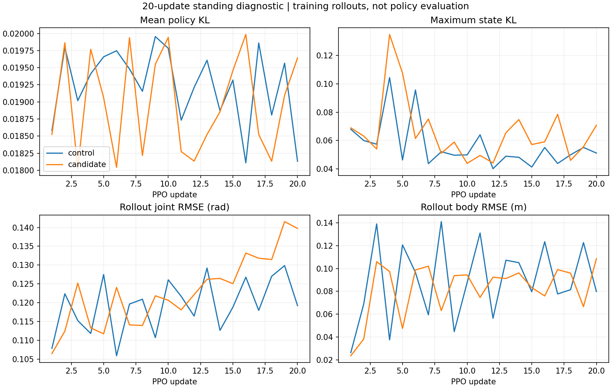

# 2026-09-22：有界站立学习与八片段病因定位

两条件均完成 **16 环境 × 24 步 × 20 更新**，合计 **15360 transitions**。
停止点已保存检查点、退出两个仿真进程并释放本任务 GPU；此后分析全部在 CPU 完成。
40 次更新的接口复核通过，但随机动作下仍有左踝子步速度峰值，尚不支持扩大训练。
八片段另存 v2：修正了已定位的 IK 迭代不足，悬空和腰部贴限仍未解决，继续隔离。

原始目录：`runs/standing_learning_20260922/`。预算和控制变量见
[预登记计划](standing_learning_plan_20260922.md)；上一轮无学习对照见
[资产与载荷候选报告](asset_standing_validation_20260922.md)。

## 训练入口与控制变量

新增 `pgmt/train/standing_diagnostic.py`，由 `fixed_clip_diagnostic.py` 显式加载冻结候选、
四起点和对应静止参考。载荷候选、起点及参考文件与原 `fixture_v4` 字节一致，
只在新 manifest 增加训练契约、起点指纹和本轮停止预算。

- 两条件使用同一个种子 0、新建策略；唯一不同的初始参数为 `actor.mlp.net.6.bias`。
  初始观测、探索标准差、环境和 PPO 配置相同。候选仅改变 Actor 初始目标中心，
  rollout 始终执行真实策略采样动作，没有动作覆盖或附加外力。
- 直立、roll ±1°、pitch +1°四起点各重复四份。16 环境不是 16 个独立场景，
  本次也不是多随机种子实验。实际/参考姿态 q=0，使用 nominal reset。
- PD **80/2**、逐关节上限、A23、奖励项/权重、网络、PPO 算法和终止规则保持。
  学习率仍按 1000 更新日程，20 只是停止点；没有接续旧 842-update checkpoint。
- 静态诊断关闭 recovery、自适应采样、随机化、观测扰动和延迟；这不替代正式训练流程。
  八个运动片段均未混入站立训练。没有自动追加评估、100 更新或完整 Stage 1。

`setup/run_standing_learning_pair.py` 串行执行两组并保存进程、命令、实际更新数和 GPU 释放记录。
`StandingCapture` 在奖励更新历史缓存前保存物理状态、参考、EE 速度、动作、奖励、终止及
reset 前后观测；每次 PPO 保存更新前后参数和完整 storage。
子步监视器额外保存所有 5 ms 的 29 维关节速度，两组各 `[1920, 16, 29]`，
合计 **61440 个环境子步**，不只保存峰值。

## 实际结果与解释边界

下表来自持续更新策略的训练 rollout，**不是 initial/final 冻结策略评估**。

| 指标 | 原目标 | 载荷候选 |
|---|---:|---:|
| 更新数 / transitions | 20 / 7680 | 20 / 7680 |
| 接受的 Actor 优化器步数 | 101 | 95 |
| 平均 exact KL | 0.01924 | 0.01898 |
| 最大单状态 KL | 0.10442 | 0.13485 |
| 已结束 episode 数 | 114 | 93 |
| 已结束 episode 平均时长（s） | 1.268 | 1.532 |
| 已结束 episode 最长时长（s） | 1.600 | 3.140 |
| 训练状态平均倾角（°） | 19.02 | 14.64 |
| 关节 RMSE（rad） | 0.11957 | 0.12331 |
| 估计力矩达到 ≥99% 上限的关节样本比例 | 2.60% | 2.57% |
| 原始子步速度峰值（rad/s） | 45.173 | 54.800 |
| >45 rad/s 的环境子步数 | 1 | 1 |

候选条件的平均时长和倾角更好，但关节误差没有同步改善。不能把两条件差异归因于学习，
因为初始化本身不同、缺少冻结策略前后配对评估，且只有一个种子。20 更新主要检查接口，
未显示明确改善不等于无法学会。所有更新均至少接受一次 Actor 步；后期接受步数减少，
与 KL 约束下的回退及 critic completion 一起记录，不能把名义训练 epoch 当作有效 Actor 更新。

**本预算每个环境累计只有 24×20×0.02=9.6 秒。** 10 秒 timeout 在结构上不可达，
因此真实 timeout 分支未覆盖。零 timeout 不能解释成 10 秒完成率，CPU 单测也不替代该物理证据。
已结束 episode 时长统计不包含停止预算时尚未结束的 episode。



## CPU 复核和剩余速度事件

`setup/analyze_standing_learning.py` 复算全部 40 次更新：

- latent → 合法位置目标与实际执行动作一致；动作概率、价值及 next value 与采集记录在容差内一致。
- 独立 GAE 和分头归一化优势通过；奖励按物理/参考同一时刻重新计算，EE 历史缓存和 reset 检查通过。
- 当前参考进度与物理时间一致；更新前后策略链连续；更新后 exact KL 可重算且每轮有有效 Actor 更新。
- 全量子步数据有限、尺寸完整；每个控制步最后子步速度与 reset 前物理读回一致。

CPU/GPU 数值比较使用绝对加相对容差，并非逐位一致：最大动作差约 2.38e−7，
log-prob 差约 7.63e−6，GAE 差约 1.22e−4，奖励差约 7.63e−6，KL 差约 1.30e−8。
value 最大绝对差约 2.14e−4，通过对应相对/绝对组合容差；EE 历史衔接误差为零。

`setup/analyze_standing_speed_events.py` 从完整子步数据提取两个事件：

| 条件 | 更新 / 全局控制步 / 环境 | 左踝 roll 四个子步速度（rad/s） | 控制步末根高度 / 垂直速度 |
|---|---|---|---|
| 原目标 | 3 / 54 / 11 | 0.168, **−45.173**, −1.502, 1.739 | 0.427 m / −2.280 m/s |
| 候选 | 12 / 274 / 5 | −1.082, 0.880, **−54.800**, −1.182 | 0.495 m / −1.650 m/s |

控制步和子步从 1 计，环境从 0 计。这两次均发生在身体下落期间，不是 reset 首步；
控制步末速度已经较小，现有控制步终止检查没有捕获中途峰值。
对应末态关节角 −0.0347/0.0692 rad，仍在 ±0.2618 rad 限位内；末态估计力矩 6.73/50 Nm。
这些角度和力矩不是峰值子步时刻的测量，不能据此断言接触求解器或控制器是唯一原因。
本轮保留原始速度，未新增截断、修改力矩或终止规则。

## 八片段：高度、腰部与跳变的具体来源

下列锚定帧均是 **v1 的完整源序列中的零基索引**，全部位于被评分的 150 帧片段之外。
逐碰撞几何索引、源地面锚定帧/身体、完整最低点曲线、解析及 IK 轨迹均保存在 cause audit。

| 片段 | 源序列 | 片段起点 | 碰撞锚定帧 / 身体 | v2 最小足底间隙（cm） |
|---|---|---:|---|---:|
| low_motion_0 | aiming2_subject3 | 150 | 7305 / right_knee_link | 19.92 |
| low_motion_1 | aiming1_subject1 | 1200 | 3014 / right_ankle_roll_link | 13.27 |
| low_motion_2 | aiming2_subject2 | 6270 | 5265 / right_ankle_roll_link | 9.21 |
| low_motion_3 | aiming2_subject5 | 6480 | 1696 / right_ankle_roll_link | 15.82 |
| slow_walk_0 | walk2_subject4 | 1380 | 5392 / right_ankle_roll_link | 6.48 |
| slow_walk_1 | walk1_subject1 | 5430 | 7428 / right_ankle_roll_link | 9.27 |
| slow_walk_2 | walk3_subject4 | 5580 | 6540 / right_knee_link | 27.24 |
| slow_walk_3 | walk3_subject2 | 480 | 7148 / right_ankle_roll_link | 6.51 |

高度问题来自当前整序列最低点规则与片段支撑需求的冲突。在轨迹和单一平地不变时，
不穿地要求新增平移量 ≥ −整序列最低高度，而片段进入 2 cm 容差要求平移量
≤ 0.02−片段最低高度；八段都没有可行交集。因而换一个常数不能同时满足这两个条件。
源骨架的脚趾点在同样源地面规则下也可能悬空，例如 slow_walk_2 中位高度约 15 cm；
这仅是源关节点代理，不是接触标签，不能将全部问题归因于机器人 FK 几何。
后续应检查源地面/支撑分段与形态目标，而非逐帧把机器人压到地面。

慢走腰 pitch 的来源有两类：

| 片段 | 源映射 pitch 超过 0.52 rad 比例 | 解析输出贴限比例 | v1 IK 后贴限比例 |
|---|---:|---:|---:|
| slow_walk_0 | 70.0% | 70.7% | 100.0% |
| slow_walk_1 | 0% | 0% | 41.3% |
| slow_walk_2 | 0% | 0% | 100.0% |
| slow_walk_3 | 0% | 0% | 89.3% |

第一段在源映射阶段已经越限，其他三段主要由 IK 的身体位置目标推向上限。
对全部贴限帧将腰 pitch 向内减小 0.001 rad，原加权位置误差加姿态先验的目标值均增大。
这支持“当前目标偏好边界”的解释，不能仅靠更高迭代数或直接清零腰部修复。
当前名为 `lambda_smooth=0.05` 的项是逐帧吸引到解析姿态，**没有相邻帧时间平滑约束**。

`low_motion_2` 的关键异常位于源帧 **6375→6376 的 right_elbow**：解析映射相邻差
+0.02029 rad，10 次 IK 迭代输出差 **−0.29222 rad**，30 次迭代变成 **+0.01357 rad**。
1/5/10/30 次迭代的同窗对照表明相邻帧原先处于不同收敛阶段，源解析关节没有对应幅度的跳变。
该证据支持修正本例迭代不足，不代表整个 IK 已全局收敛。

## 独立 v2 的范围与验证

新目录为 `data/processed/lafan1_g1_asset_grounded8_v2`，仅将本次导出的 IK 迭代上限
从 10 改为 30，保持目标函数、关节限位、源序列/片段起点和整序列锚定规则。
`setup/build_asset_reference_subset.py --ik-iterations 30` 显式选择新预算，旧默认仍为 10。
原 77 文件 `lafan1_g1_mesh_v2` 及 v1 八文件的 SHA-256 全部保持不变。

- 1200 个评分帧的原 IK 目标值均未增加，8 段关节合法、独立脚碰撞接触重查询一致。
- 两种 reset 各检查每段全部 150 帧：参考根高度、接触一致，额外 reset lift 为零。
  根位移/旋转连续性及 qvel 差分误差逐段保存在运行时 CPU 审查，不是 Isaac 动力学可行性验收。
- low_motion_2 整段最大关节步长 **0.29222→0.09849 rad**，最大速度 **8.7667→2.9547 rad/s**。
  原异常右肘帧对则为上文 0.29222→0.01357 rad，二者不是同一统计量。
- 其他片段并非全面改善，例如 slow_walk_0 峰速 2.2657→2.2983 rad/s，
  slow_walk_2 足底最低间隙 26.82→27.24 cm；腰贴限基本保留。
- 所有八段仍无参考足接触，间隙 **6.48–27.24 cm**。新目录标记
  `quality_status.json: training_approved=false`，不进入本轮站立或正式训练。

v2 是对一个已证实问题的局部修正，不能称为“参考已修好”。
生成器 summary 的 old/new 指原始 mesh_v2 与新 v2；严格的 v1/v2 对照使用独立 comparison JSON。

## 证据、复现与检查

主要汇总：[训练逐轮数据](results/standing_learning_20260922.json)、
[速度事件](results/standing_speed_events_20260922.json)、
[参考病因与 v2 对照](results/reference_causes_v2_20260922.json)、
[指纹和预算验证](results/standing_learning_verification_20260922.json)。
新八片段的冻结清单为 `eval/manifests/asset_grounded8_v2_diagnostic_20260922.json`。

服务器保留每条件 `physics_v1/{control,candidate}/initial.pt`、`policy.pt`、
`initial_evidence.pt`、`metrics.json`、`episode_evidence.json`、全部 `captures/update_*_{before,after}.pt`，
以及 `physics_v1/source_snapshot/`、`execution_ledger.json`、`gpu_release.json`。
候选/起点在 `fixture/`；CPU 病因原始数组在 `reference_causes_v2/`，v2 完整源序列在 `reference_v2/`。
更新前源码和计划也保存在 `source_before/`。

CPU 复核可用以下模块，对输出选择新的路径以免覆盖已有证据：

```bash
export CUDA_VISIBLE_DEVICES=''
export OMP_NUM_THREADS=1
export MKL_NUM_THREADS=1
python -m setup.analyze_standing_learning --source runs/standing_learning_20260922/physics_v1/control --output /tmp/standing_control_recheck
python -m setup.analyze_standing_learning --source runs/standing_learning_20260922/physics_v1/candidate --output /tmp/standing_candidate_recheck
python -m setup.analyze_standing_speed_events --source runs/standing_learning_20260922/physics_v1 --output /tmp/standing_speed_recheck.json
```

其他复算入口：`setup.audit_reference_causes`（源映射、锚定、IK 窗口）、
`setup.build_asset_reference_subset`（30 次迭代新导出）、`setup.compare_reference_versions`
（逐帧目标及 v1/v2 对比）、`setup.audit_asset_reference_subset`（CPU 两种 reset 一致性）。
各入口 `--help` 列出必须显式提供的资产、清单和输出路径。物理启动的完整实参保存在 execution ledger。

本轮回归 **852 passed、2 skipped**；新增定向检查含冻结输入篡改拒绝、配对策略仅偏置不同、
采集缓存所有权和原始子步保留。CPU mock 仅另运行 8 transitions 的接口冒烟，不计入物理预算。
首次病因汇总因 numpy 整数 JSON 序列化失败、首次 mock 分析因无 Isaac 辅助分项证据失败，
均保留原目录；修正分析适配后重新输出成功版本，没有重跑或扩大 GPU 预算。

当前下一步见[后续安排](next_steps_20260922.md)：先利用已有证据定位随机探索下的踝关节瞬态，
独立修正源地面/支撑与 IK 形态目标。正式扩规模、多种子 100 更新和匹配评估仍待后续决定。
