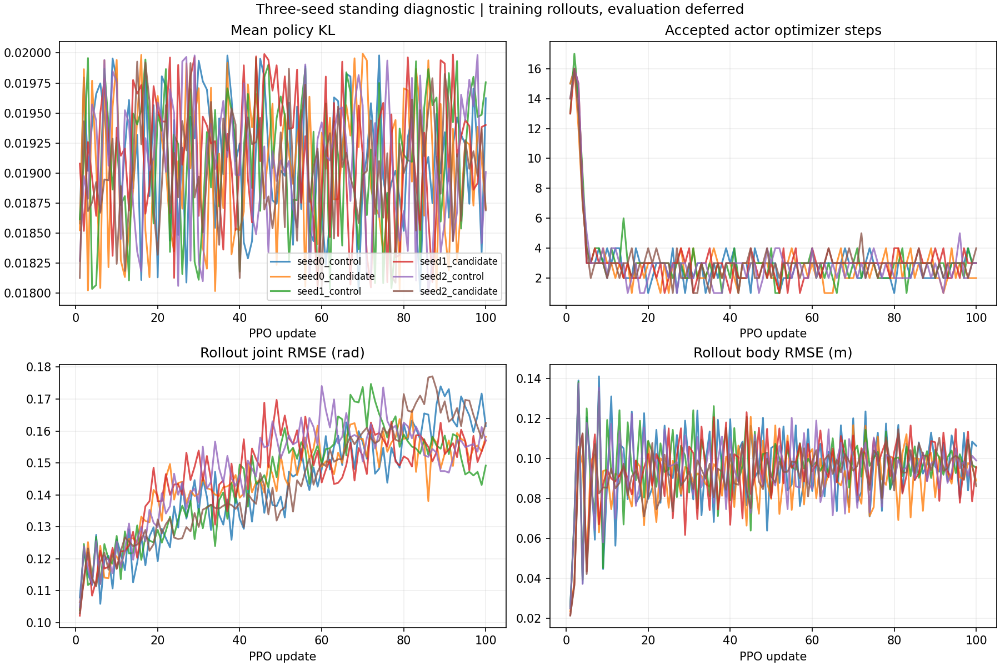
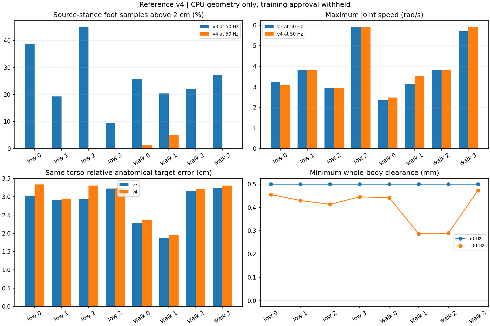

# 三种子站立学习与参考 v4

状态：**本批完成**。六场各 100 更新，共 **230400 transitions、600 次 PPO 更新**，全部通过 CPU 复核；六个 GPU 子进程均已退出。匹配物理评估继续后置，未自动延长训练。

## 站立学习实际结果

以下均为随机策略训练 rollout 的统计，不能当作 initial/final 冻结策略评估。

|种子|条件|已结束 episode 平均 / 最长时长 s|平均倾角 °|关节 RMSE rad|10 s timeout 次数|
|---|---|---:|---:|---:|---:|
|0|原目标|1.261 / 1.84|18.74|0.1439|0|
|0|载荷候选|1.436 / 3.14|17.90|0.1453|0|
|1|原目标|1.178 / 1.54|18.17|0.1451|0|
|1|载荷候选|1.354 / 2.76|20.71|0.1467|0|
|2|原目标|1.314 / 2.60|17.29|0.1483|0|
|2|载荷候选|1.419 / 2.28|18.75|0.1449|0|

逐种子均值的均值 ± 样本标准差：原目标 **1.251 ± 0.069 s**，候选 **1.403 ± 0.043 s**。
候选原本就有初始化优势，不能把两条件间的差异归因为学习收益。候选三个种子的前 20 / 后 20
更新平均 episode 时长分别为 1.532→1.378、1.515→1.321、1.553→1.287 s；原目标为
1.268→1.218、1.198→1.131、1.250→1.302 s。本轮未显示一致的训练内时长改善，但也不能
由 100 更新直接认定不可学习。倾角和误差表包含各自完整训练过程，仍需共同存活窗口的匹配评估。

600 个 rollout 的动作、概率、价值、GAE、奖励/EE 时序及 KL 复核通过；GAE 的独立单精度
递推与保存结果一致。共接受 **1881 个 Actor 优化器步**，全部更新平均 KL ≤ **0.019994**；
最大单状态 KL 约 **0.528**，不能将平均约束理解为逐状态上限。最大值样本处于下落末段，
但也有直立样本达到约 0.201。各组第 100 更新的 Actor 下肢/辅助头梯度余弦为
−0.874 至 −0.974，说明这些样本上仍有目标冲突，不能单凭该相关性判定学习困难的原因。

完整保存 **921600 个环境子步速度**。有 10 个子步超过诊断阈值 45 rad/s，最高 54.800；
其中三次 seed=2 踝部峰值发生在控制步读回倾角约 12°–22°，不能全部归类为末期跌倒。
最明显的例子为 control 第 1855 步：右踝首子步 46.696 rad/s，前一控制步末速度仅 0.089，
动作改变 −0.0141 rad，首子步前 PD 力矩估计约 −0.681 Nm；随后子步速度立即回落，
该 episode 在 0.42 s 后结束。当前证据排除了该处的大目标跳变，但缺少相应子步位置/接触，
仍不能认证瞬态的物理准确性。已保存全部事件前后控制步上下文，本批没有新增物理回放或调参。

## 固定协议

- 两条件 control/candidate，种子 0/1/2；逐种子依次运行，每场 16 环境 × 24 步 × 100 更新，共 230400 transitions。
- 冻结静止参考、载荷候选和四起点，配对网络仅 Actor 最后目标偏置不同；从新初始状态开始，旧 20 更新 checkpoint 保留。
- PD 80/2、奖励、网络、PPO、物理设置和终止不变；1000 更新学习率日程不变。完整保存 rollout、更新前后权重和全部 5 ms 子步速度。
- 每场独立进程、预算校验和进程组清理；训练到预算立即保存并释放 GPU。无自动续训和评估。
- 新清单 `runs/standing_multiseed_20260922/protocol_v1/plan.json`，旧清单保持原字节。代码入口为 `setup.standing_multiseed_protocol`、`setup.run_standing_multiseed`。

独立评估入口 `setup.evaluate_standing_multiseed` 已准备：24 个固定任务，每任务独立物理进程，四起点首个 episode、最多 500 控制步，共最多 48000 transitions。初始/最终、确定性/随机动作分别记录；随机策略使用按种子固定的完整噪声带。实际推进的已结束环境也计入预算，保存 active mask 以便 CPU 比较共同存活窗口。评估本批未运行，10 秒物理分支尚待实际验收。

训练结束后补入运行依赖和 12 个 checkpoint 的指纹检查，修正 Path/tuple 与 JSON 表示的
比较方式；24 个真实任务均通过 CPU checkpoint 选择，六组四起点/500 步配置通过 CPU mock
检查。独立 `setup.analyze_standing_evaluation` 按共同存活窗口比较倾角/误差并单列速度、
PD 估计力矩尾部。CPU 准备不能替代物理验收。具体命令保存在运行目录的
`deferred_evaluation_commands.json`，没有执行。

## CPU 参考修正

原八片段另存 `data/processed/lafan1_g1_asset_grounded8_v4`。先核查 v3 的源脚趾支撑代理，保留原 mask 与不确定性：例如 low_motion_2 的源双支撑帧中，51.8% 的左右脚趾高度相差超过 1 cm；这不是实测源接触标签。

在原时间窗口及前后各最多 0.5 秒真实上下文内，联合拟合 12 个腿关节与根高度，保留根 XY、朝向、腰部与上肢。目标包含支撑脚底间隙、摆动脚位置、腿部关键点、姿态先验与时间连续性；再做带全身非穿地约束的连续高度修正，最后统一增加约 0.49 mm 几何余量。所有参数均为离线重定向约定，没有修改 RL 奖励。

v4 原生输出 50 Hz，重新差分 qvel，并逐帧独立查询脚碰撞球与平地网格。对比均在同一 50 Hz 网格进行，评分窗口仍为原来的 5 秒，另保留未来参考 padding。

|片段|源支撑脚高于 2 cm：v3 → v4|最大关节速度 rad/s：v3 → v4|
|---|---:|---:|
|low_motion_0|38.76% → 0%|3.253 → 3.077|
|low_motion_1|19.32% → 0%|3.819 → 3.801|
|low_motion_2|45.19% → 0.21%|2.955 → 2.948|
|low_motion_3|9.35% → 0%|5.931 → 5.920|
|slow_walk_0|25.79% → 1.15%|2.348 → 2.486|
|slow_walk_1|20.43% → 5.11%|3.151 → 3.532|
|slow_walk_2|22.02% → 0%|3.809 → 3.824|
|slow_walk_3|27.35% → 0.28%|5.709 → 5.900|

两种 reset 下共 4000 个源帧起点的参考高度/接触一致，reset lift=0。50 Hz 共 2000 查询无接触标签差异，最小全身间隙 0.49994 mm；100 Hz 额外 4000 查询仍无穿地，最小间隙 0.28640 mm，但二值接触插值差异仍有 0.1%–0.4%。不把原生查询网格上的一致性外推到任意采样时刻。

相对同一个躯干坐标系下的解剖目标，平均身体位置误差增加 0.19–3.67 mm，作为支撑约束的代价明确报告。部分峰速上升，low_motion_2/3 达到 200 次求解评估上限，slow_walk_0 原有源腰姿态贴限仍保留。因此 **training_approved=false**，本批没有将 v4 加入站立学习，也没有进行参考物理跟踪。

初次离线试算发现零附近的修正变量遇关节边界后，使数值优化的初始信赖域半径过小，出现几乎未移动就宣称收敛。已改为用绝对关节/根坐标确定信赖域，目标函数不变，并增加边界回归检查。初次试算及代码快照保存在 `reference_v4_trial1`，最终候选独立保存，没有覆盖原数据或 v1/v2/v3。

## 验证与证据

- 入口、联合支撑、精度审计、后置评估完整性与共同窗口检查均通过；最终全量 **874 passed、2 skipped**。
- 种子 0 两条件的前 20 更新与旧实验完全一致：动作、奖励、更新前后权重及全部子步速度的最大差均为 0。
- 第一场 CPU 审计在第 73 更新遇到单精度价值误差 0.0004878；独立双精度前向的最大误差为 0.00009974。CPU 价值复算改用双精度后回到原容差；Actor/log-prob/reward/KL 路径及训练保持原样。保留 `cpu_audit_v1` 失败记录和 `value_roundoff_audit_73.json`，中间复核为 `cpu_audit_v2`。
- 随后候选组第 98 更新的近零 GAE 与双精度理想递推相差 0.00020915（该批值函数幅值最高约 653）。独立 NumPy 单精度递推与保存结果最大差为 0；审计增加执行精度一致性及基于运算数幅值的双精度前向舍入误差界，原比较容差不变。终止/timeout 区分及故意损坏优势值的拒绝检查通过。两次失败记录保留，最终完整审计输出改为 `cpu_audit_v3`。
- 运行目录 `runs/standing_multiseed_20260922/`：`physics_v1` 为物理记录，`cpu_audit_v3` 为逐更新 CPU 复核，`reference_v4` 为离线参考证据。
- 279 个原有源码/数据/静止 fixture 文件指纹不变；六场记录的冻结训练源码均一致。预算、配对、checkpoint、GPU 退出和 CPU 准备验证见[最终验证](results/standing_multiseed_verification_20260922.json)。训练释放 GPU 时出现的其他用户进程未受本任务操作，最终复查 GPU 9 为 28 MiB、0% 利用率。
- 汇总数据：[训练与审计](results/standing_multiseed_20260922.json)、[参考 v4](results/reference_support_v4_20260922.json)；冻结数据指纹：[八片段 manifest](../eval/manifests/asset_grounded8_v4_diagnostic_20260922.json)。
- 尚不能从训练 rollout 宣称初始/最终策略学习收益；匹配评估后置，正式 Stage 1 扩规模仍未启动。
