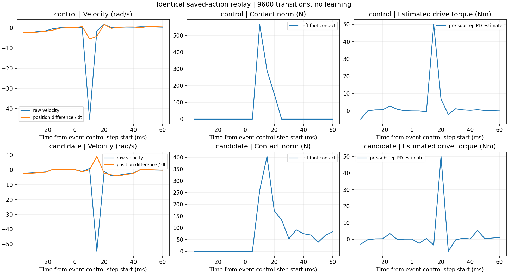
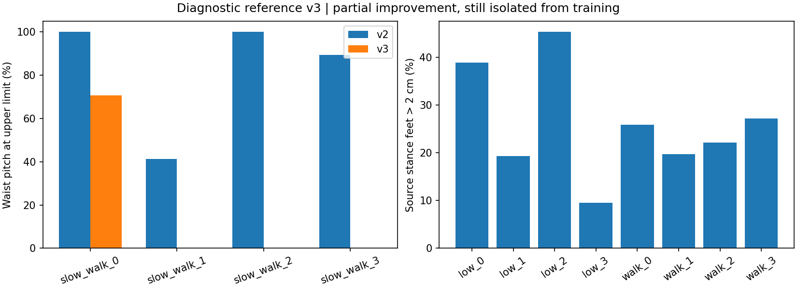

# 2026-09-22：站立动作回放与参考 v3

本批完成已有记录的 CPU 对齐、两组已存动作回放，以及原八片段的独立 v3 导出。
物理预算恰好 **9600 transitions，0 次 PPO 更新**；两组仿真进程均已退出，本任务 GPU 已释放。
PD 80/2、奖励、网络、物理参数和终止规则保持不变。回归 **858 passed、2 skipped**。

回放把两次左踝速度峰值定位到跌倒触地的同一子步；没有发现动作或读回不一致。
这支持继续保留监控的有界站立学习，不要求为消灭单次峰值而修改奖励或无限调参，
但不等于已证明求解器冲击幅度与真实硬件完全一致。本批没有启动新的学习或冻结策略评估。
参考 v3 部分改善了腰部和支撑，仍有明确质量缺口，继续隔离，不进入训练。

前置结果见[20 更新站立诊断](standing_learning_20260922.md)，原始证据在
`runs/standing_replay_reference_20260922/`。

## 1. 已有数据表明还缺什么

CPU 对齐原控制步 54 / 候选控制步 274 前后各五步的目标、接触、根状态和全部原始子步速度。
两次事件前身体都在下落，前一控制步末均未记录到左脚接触；事件所在控制步末开始出现足部接触。
原目标事件的目标变化只有 −0.000623 rad，候选为 −0.03161 rad，不能简单归因为大动作跳变。
已有记录缺峰值周围的完整子步位置、接触和力矩时序，因此执行了预登记的回放。

CPU 准备没有采集新物理样本。`setup.prepare_standing_replay` 直接从原 capture 提取
每条件前 300 步 `[300,16,29]` 动作序列，保存来源指纹、对应控制状态和原始子步速度。

## 2. 无学习回放与峰值证据

| 条件 | 环境 × 控制步 | transitions | PPO 更新 | 原轨迹核对 |
|---|---:|---:|---:|---|
| 原目标 | 16 × 300 | 4800 | 0 | 全部位置、根位置、子步速度和 reset 一致 |
| 载荷候选 | 16 × 300 | 4800 | 0 | 全部位置、根位置、子步速度和 reset 一致 |
| 合计 | | **9600** | **0** | 两条件均完成 |

沿用相同 16 环境布局、四起点、参考、物理配置和已存动作，不重新采样策略、不执行优化器。
初始观测匹配；每组 300 步中，关节位置、根位置和全部子步速度的最大差均为 **0**。
保留 2400 个批量子步，即 **38400 个环境子步**。仿真中逐步验证：

- 原始 PhysX 位置/速度与 articulation 缓存一致，PhysX 目标与策略保存动作一致。
- 接触传感器读数与直接接触查询一致，传感器时间戳确实以 5 ms 更新。
- 所有记录有限；原终止规则保持，reset 时机与原训练一致。
- 每子步力矩记录可由该子步开始时的 `80*(target-q)-2*qvel` 加原上限裁剪复算。

这里的 `applied_torque` 来自 **Isaac 隐式 PD 的估计**，不是求解器实测驱动力矩。
这一口径已由本机 Isaac Lab `ImplicitActuator.compute` 源码核实并写入数据。
估计值在子步开始计算，接触、位置和速度在子步结束读回，报告明确保留该时刻差。

| 峰值子步 | 原目标：54 / 2 / env 11 | 候选：274 / 3 / env 5 |
|---|---:|---:|
| 原始左踝 roll 速度（rad/s） | −45.173 | −54.800 |
| 左脚接触力范数（N） | 567.3 | 404.1 |
| 子步开始的 PD 估计（Nm） | −0.488 | −3.390 |
| 下一子步的 PD 估计（Nm） | 50.0 | 50.0 |
| 该子步位置差 / dt（rad/s） | −5.489 | +8.975 |

原目标在峰值子步首次触地；候选的左脚在前一子步开始触地，峰值子步接触力增大。
两者均是先出现大速度，再在下一子步出现饱和的 PD 估计；不能把后者当作峰值前的大力矩命令。
目标、位置都在原合法区间内。

位置增量与子步末速度并不相等，候选峰值处甚至方向不同。因此这些数据支持
“与跌倒接触同步的求解器瞬态”，**尚不能认证瞬时冲量的物理准确性**。
本批没有改解算器或设置新的 45 rad/s 物理定律，也没有把速度裁剪后再验收。
后续若出现站立尚未失稳时的大峰值、非有限状态或新的读回差异，应再按该事件检查。

## 3. 参考问题的进一步定位

本地 BVH 层级提供了可直接核实的证据：`LeftArm → LeftForeArm → LeftHand` 对应
肩关节、肘关节、腕关节的位置。例如 walk2_subject4 两段骨长为 33.0/25.2 cm；
`LeftShoulder → LeftArm` 是约 11.28 cm 的肩带段。
旧全链 IK 把 LeftArm 对到机器人肘部、LeftForeArm 对到 wrist_roll；旋转映射的
肘部来源也使用 LeftArm。这些对应会把不同的身体部位拉在一起。

此外，单一全身缩放不能使源人体的肩高、上臂/前臂/腿长同时等于 G1。
仅增加 IK 迭代不会改变这一目标冲突。旧 `data/eval_retarget.py` 的同名指标沿用旧对应；
本批保留历史实现和结果，不能把旧指标直接当作新解剖对应下的误差。

源地面方面，八条完整源序列的静止低位脚趾点支持一个接近原 z=0 的平面，估计值为
−0.0004 至 +0.0201 m。此前用所有源身体点最低值，再用全机器人碰撞最低值整体抬高，
会受到评分窗口之外的下蹲/膝部等帧影响。源脚趾是支撑代理，不能冒充真实接触标签。

## 4. v3 的显式工程约定

新增的 `data/support_retarget.py` 和 `setup/build_support_reference_subset.py` 为独立入口。
旧 retarget/IK 默认路径、v1、v2 和原始数据全部保持；以下选择不是论文作者公开实现。

1. 依照肩—肘—腕的实际骨架层级修正上肢旋转来源；位置目标保留源肢段方向，
   使用 G1 的对应骨长和肩带几何，wrist_roll 取肘到腕之间的对应位置。
2. 腰部目标使用原源胸廓相对骨盆旋转在关节限位内的投影；该目标负责腰部姿态，
   位置 IK 只优化肢体，不再通过改变腰部弥补身体比例差。源姿态真正越限的部分仍保留投影结果。
3. 对完整源序列，用低位脚趾速度 ≤0.15 m/s、左右高度差筛选及 2 cm 平面邻域识别支撑，
   保留至少三帧的连续支撑段。平面取候选点高度中位数，全过程不使用 rollout 接触。
4. 对完整源序列一次求解连续根高度修正。支撑残差、根轨迹先验、修正速度和加速度
   一起进入凸优化，所有 URDF 碰撞体不穿地为硬约束，随后才裁出原固定片段。
   目标系数分别为支撑 1、位置先验 0.01、速度 0.01 s²、加速度 0.0001 s⁴，
   碰撞余量 0.01 mm。这些是离线重定向目标系数，**RL 奖励权重未改**。
5. 接触标签仍由导出姿态的脚碰撞球与地面网格独立查询，容差 2 cm。
   源支撑代理不直接写入接触标签。

先对固定窗口做 CPU 可行性审查，再按同一规则优化完整源序列、导出 8 个原片段及未来 padding。
v3 目录为 `data/processed/lafan1_g1_asset_grounded8_v3`；清单为
`eval/manifests/asset_grounded8_v3_diagnostic_20260922.json`。

## 5. v3 的改善和未通过项

表中“支撑脚超容差”是源支撑代理标记的脚样本中，导出脚底高于 2 cm 的比例；
不是物理仿真跌倒率，也不是把所有摆动脚都要求贴地。

| 片段 | 腰 pitch 贴限 v2→v3 | 左/右参考接触比例 v3 | 支撑脚超容差 | 最大关节速度 v2→v3（rad/s） |
|---|---:|---:|---:|---:|
| low_motion_0 | 0%→0% | 43.3% / 79.3% | 38.8% | 3.253→3.253 |
| low_motion_1 | 0%→0% | 58.0% / 100% | 19.3% | 3.931→3.819 |
| low_motion_2 | 0%→0% | 50.7% / 58.0% | 45.3% | 2.955→2.955 |
| low_motion_3 | 0%→0% | 87.3% / 84.0% | 9.5% | 5.934→5.934 |
| slow_walk_0 | 100%→70.7% | 70.0% / 60.7% | 25.8% | 2.298→2.348 |
| slow_walk_1 | 41.3%→0% | 94.7% / 37.3% | 19.7% | 3.136→3.156 |
| slow_walk_2 | 100%→0% | 83.3% / 65.3% | 22.1% | 3.544→3.811 |
| slow_walk_3 | 89.3%→0% | 52.7% / 86.0% | 27.2% | 5.082→5.717 |

v2 八片段接触比例均为零；v3 恢复部分接触，但左右脚尚未同时满足所推断的支撑约束。
slow_walk_0 留下的 70.7% 贴限来自源映射越界，不是本轮 IK 又将其拉向边界。
新解剖/骨长目标下的位置残差均值从约 6.5–8.4 cm 降到 1.9–3.2 cm；该指标是新优化目标，
不与旧错误对应下的数字直接比较，也不能代替物理可执行性验证。

关节角合法，完整源序列的离散帧全身碰撞不穿地，qvel 与实际导出角度差分一致。
原八个评分窗口和两种 reset 共 2400 个 CPU 起点的参考高度/接触均一致，额外 lift 为零。
这些是几何和接口验证，不是新参考的 Isaac 动力学实验。

剩余问题已具体化：

- 给定 v3 关节轨迹，8.7%–86.7% 的源支撑帧无法仅靠根高度平移，同时满足所有支撑脚的
  2 cm 容差和全身不穿地。这说明后续需要关节与支撑联合约束，继续只调高度不足以解决。
- 部分峰速上升，例如 slow_walk_3 5.082→5.717 rad/s。源旋转和根轨迹连续性指标全部保存，
  没有因某项改善就把其余退步省略。
- 50 Hz 的 2000 个插值时刻中，最深轻微穿地 **0.583 mm**，逐段有 0.2%–1.4% 的
  几何接触与插值二值标签不一致。离散帧约束不自动保证插值路径和标签一致；本批未静默修改运行时采样。

因此 `quality_status.json` 明确为 **training_approved=false**。v3 是局部改进候选，
仍不混入站立或正式训练。参考修正与已验证静止参考上的站立学习相互独立。

## 6. 复现与验证记录

可分享汇总：[回放 JSON](results/standing_replay_20260922.json)、
[参考 v3 JSON](results/reference_support_v3_20260922.json)、
[预算/指纹/测试验证](results/standing_replay_reference_verification_20260922.json)。

原始目录内保存：

- `cpu_events_v1/`：原控制时序、两条动作序列、原轨迹与 SHA-256。
- `physics_v1/`：完整启动命令、进程与预算记录、释放记录、冻结源码、每条件 metrics/substeps。
- `reference_audit_v1/`：导出前固定窗口可行性审查。
- `reference_v3/`：全源序列结果、源支撑段、几何约束、目标、根修正和冻结清单。
- `reference_v3_runtime_audit.json`：两种 reset、根/关节连续性、双脚约束可行性与 50 Hz 检查。
- `source_before/`、`source_manifest_before.json`、测试日志：本批之前的代码与历史状态。

CPU 模块入口为 `setup.prepare_standing_replay`、`setup.analyze_standing_replay`、
`setup.build_support_reference_subset`、`setup.audit_support_reference_subset`；`--help` 显示显式输入和新输出路径。
物理入口为 `setup.run_standing_replay_pair`，严格两组各最多 300 步，拒绝非有限或超预算动作序列。
所有输出使用新路径，原 `mesh_v2` 77 文件、asset v1/v2 各 8 文件的指纹核对通过。
原 `pgmt/` 和旧 `data/` 源码指纹保持，本批新增的参考入口没有修改默认训练行为。

新增约束测试覆盖非足部碰撞优先于不相容支撑、连续根修正、保留真实支撑间断，以及
启动前拒绝错误回放预算。定向 11 项通过，全套 858 项通过、2 项跳过。
下一阶段见[更新后的安排](next_steps_20260922.md)。
